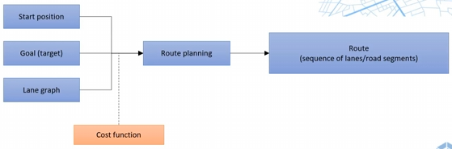
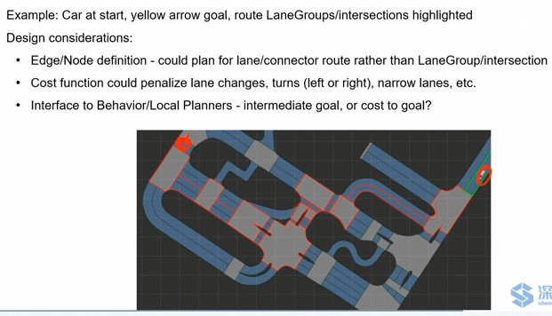

# 路径规划问题引入

Mission Planning (Route Planning) ，又称为**全局路径规划**

常用搜索算法有：Dijkstra，A*等

- 输入：起点、终点、地图（抽象）
- 过程：路径规划（成本函数）
- 输出：路径

# 需要解决的问题

1. 如何将连续的地图信息抽象出来，变成一个可搜索的离散地图
2. 用什么方法在抽象地图中进行搜索
3. 如何使用搜索结果

