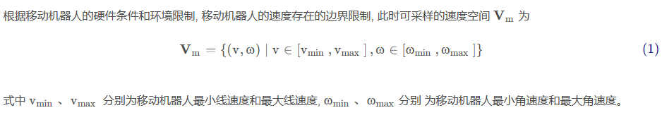
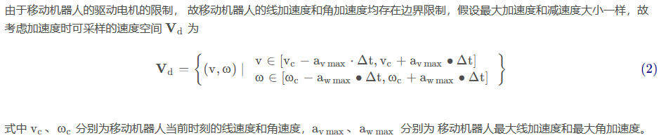
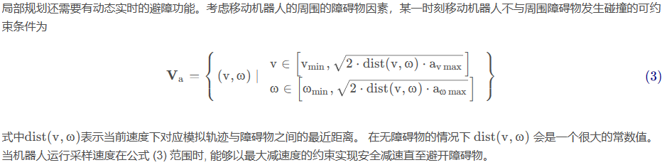
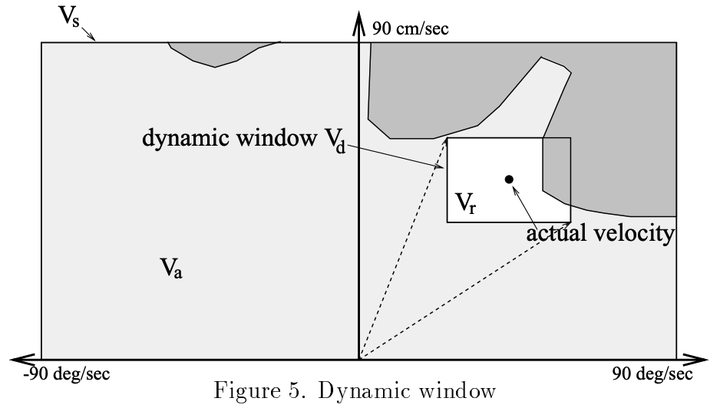
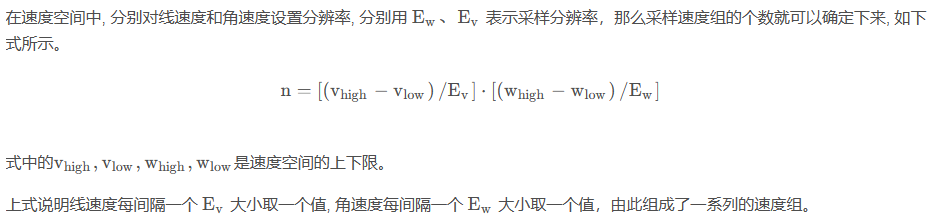
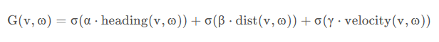
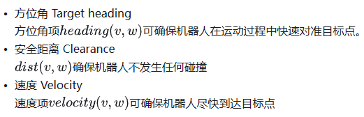
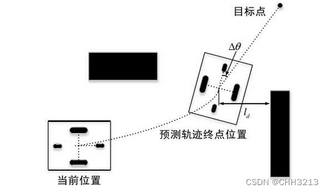
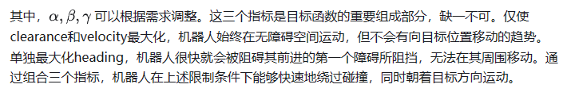
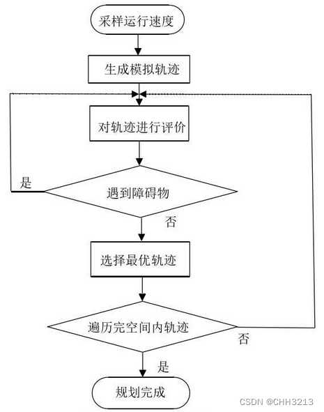

# 动态窗口法(DWA)

是基于预测控制理论的一种次优方法，属于局部路径规划算法

## 核心思想

根据移动机器人当前的位置状态和速度状态在速度空间 ( v , ω )中确定一个**满足移动机器人硬件约束的采样速度空间**，然后计算移动机器人在这些速度情况下移动一定时间内的轨迹， 并通过**评价函数**对该轨迹进行评价，最后选出评价最优的轨迹所对应的速度来作为移动机器人运动速度， 如此循环直至移动机器人到达目标点

对于无人驾驶而言，将车辆的位置变化转化为线速度和角速度控制，避障问题转化为空间中的运动约束问题，从而通过运动约束条件选择局部最优路径

## 算法原理

- 思路：通过机器人数学模型采集机器人速度样本，并预测模拟出在样本速度下一段时间内生成的运动轨迹， 并对这些运动轨迹进行标准评价， 选择出一组最优轨迹，机器人按照最优轨迹运动。机器人的运动姿态和方向是由机器人当前的线速度及角速度 (转向速度) 共同决定的

- 步骤
  - 定义动态窗口：根据机器人的当前状态和环境信息，确定动态窗口的大小和形状。窗口的大小和形状可以根据实际需求进行调整
  - 生成轨迹：在动态窗口内，根据机器人的动力学模型，生成一系列可能的轨迹。这些轨迹应考虑机器人的最大和最小速度、加速度等限制
  - 评估轨迹：对生成的轨迹进行评估，综合考虑轨迹的安全性、平滑性和可行性。常用的评估指标包括轨迹与障碍物的距离、轨迹的曲率等
  - 选择最优轨迹：从所有评估过的轨迹中，选择最优的轨迹作为避障路径。最优的判断标准可以是安全性最高、平滑性最好等
  - 更新机器人状态：根据选择的避障路径，更新机器人的速度和方向，实现机器人的实时避障

## 速度采样

由于移动机器人硬件、结构和环境等限制条件，移动机器人的速度采样空间 $V_s$ 中 ( v , ω )  有一定的范围限制该限制主要分为三大类：

- **速度边界限制**

  

- **加速度限制**

  

- **环境障碍物限制**

  

  **注意：**这个限制条件在采样初期是得不到的，需要我们先使用**Vm∩Vd的速度组合采样模拟出轨迹**后, 计算当前速度下对应模拟轨迹与障碍物之间的最近距离, 然后看当前采样的这对速度能否在碰到障碍物之前停下来， 如果能够停下来, 那这对速度就是可接收的。如果不能停下来, 这对速度就得抛弃掉。

- 总结

  综合上述三类速度限制，最终速度采样空间是三个速度空间的交集，即

  

  图中：Va环境障碍物限制，Vd包含速度和加速度限制的动态窗口，Vr为最终采样速度空间

## 轨迹预测（推算）

- 在确定速度采样空间Vs后，DWA算法以一定的采样间距（分辨率）在该空间均匀采样
- 
- 当采样了一组 ( v , ω )后, 通过移动机器人（无人车辆）的**运动学模型**进行轨迹预测（即位置更新）

## 轨迹评价

确定了机器人约束速度范围后，有一些速度模拟的轨迹是可行的， 但是还有不达标的轨迹， 这需要对采样得到的多组轨迹进行评价择优。

通过标准评价轨迹，比较评分来选出最优轨迹， 然后选取最优轨迹对应的速度作为驱动速度。对每条轨迹进行评估的评价函数如公式 ( 5 ) 所示

评价函数考虑了方位角、安全距离和速度：

- heading ( v , ω ) 是方位角评价函数，用作评估在当前采样速度下产生的轨迹**终点位置方向**与目标点连线的夹角的误差Δθ

  由于我们想要用评价函数越大表示越优，所以用 π−Δθ 来参与评价，即 heading(v,ω)=π−Δθ

  

- dist ⁡( v , ω )  是距离评价函数，表示当前速度下对应模拟轨迹与障碍物之间的最近距离；如果没有障碍物或者最近距离大于设定的阈值，那么就将其值设为一个较大的常数值

- velocity ( v , ω )是速度评价函数，表示当前的速度大小，可以直接用当前线速度的大小来表示。它越大，表示规划轨迹上的速度越快，评价得分越高

## 算法流程

## 代码实现

见[DWA代码](代码/DWA/dynamic_window_approach.py)，可结合代码注释进行理解，并不复杂

