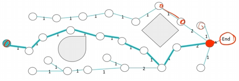
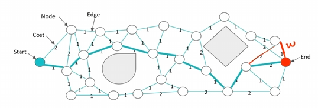
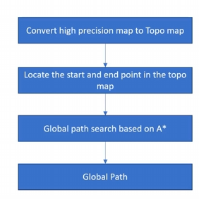
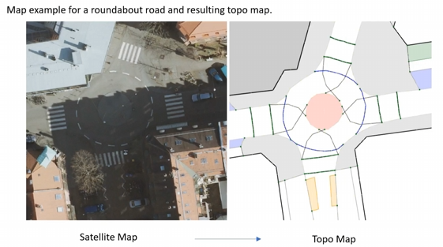
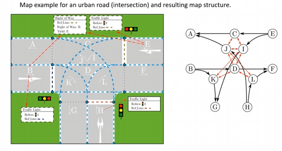
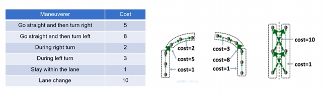
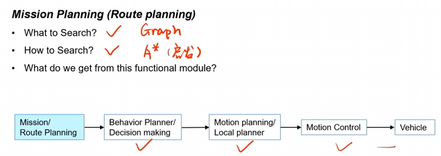

# 路径规划实际应用

- 在**局部路径规划**中，运用到tree(树)的数据结构思想，即为有限节点的集合，每个节点具有唯一父节点；

  通过构造一个tree，来找到一条路径，例如从tree的终点end处倒着寻找这个最短距离

- 在**全局路径规划**中，运用到graph(图)的数据结构思想，即为有限节点与边的集合，

  但是，每个节点不具备唯一父节点的特征，边可以为单向或者双向，且可以自带权重，比如上述的A*和Dijkstra算法

## Mission Planning的框架

1. 高精度地图（HD map）转化为离散的可以搜索的拓扑地图 (Topo Map)，有一系列的节点和边组成
2. 确定 Topo Map下的起点和终点，对节点和边赋予一定的cost
3. 基于A*的搜索算法进行全局搜索
4. 输出全局轨迹

路径搜索关注的是lane与lane的关系，所以我们需要将base map转化成为一个可以搜索的地图，每条路会形成road segment，包括车道的长度信息，车道间的连接等信息

## 举例

通过将高精度地图转化为拓扑地图，建立起每条道路间的关系，可以抽象成一个路径搜索关系

- 图中是不同的行为决策所产生的cost，这样就可以把一个高精地图规划的问题转化为一个带权拓扑图的一个搜索问题
- 例如保持车道 cost = 1，换道 cost = 10，左转 cost = 8，右转 cost = 5 等等
- 根据不同的规则，设置不同的cost，不完全基于距离来生成有向图

## 总结

1. 首先构建出一张可以用于搜索的具有节点和边相连的带权无向图
2. 其次使用搜索算法例如 Dijkstra 和 A* 在图上搜索
3. 最终得到一条可行的全局路径

