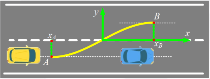
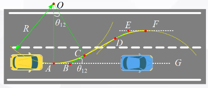

# 曲线插值法

> 局部路径规划算法——曲线插值法

## 1. 算法简介

曲线插值的方法是按照车辆在某些特定条件（安全、快速、高效）下，进行路径的曲线拟合，常见的有多项式曲线、双圆弧段曲线、正弦函数曲线、贝塞尔曲线、B样条曲线等

曲线插值法的核心思想就是**基于预先构造的曲线类型，根据车辆期望达到的状态（比如要求车辆到达某点的速度和加速度为期望值），将此期望值作为边界条件代入曲线类型进行方程求解，获得曲线的相关系数**（简单地说就是待定系数法！）

曲线所有的相关系数一旦确定，轨迹规划随之完成

## 2. 算法原理

### 2.1 多项式曲线

下面以多项式曲线为例讲解曲线插值法轨迹规划。

多项式曲线分为三次多项式曲线、五次多项式曲线、七次多项式曲线

- 针对**三次**多项式曲线，最多能确定每一个期望点的两个维度的期望状态，一般来说就是**位置和速度**。 
  $$
  x_t = a_0 + a_1t + a_2t^2 + a_3t^3\\ y_t = b_0 + b_1t + b_2t^2 + b_3t^3
  $$
  
- 针对五次多项式曲线，最多能确定每一个期望点的三个维度的期望状态，一般来说就是**位置、速度和加速度**。 
  $$
   x_t = a_0 + a_1t + a_2t^2 + a_3t^3 + a_4t^4 + a_5t^5\\ y_t = b_0 + b_1t + b_2t^2 + b_3t^3 + b_4t^4 + b_5t^5 
  $$
  
- 针对**七次**多项式曲线，最多能确定每一个期望点的四个维度的期望状态，一般来说就是**位置、速度、加速度和加加速度**。（加加速度称为`jerk`，加加加速度称为`snap`，无人机轨迹规划中有用到`snap`）
  $$
  x_t = a_0 + a_1t + a_2t^2 + a_3t^3 + a_4t^4 + a_5t^5 + a_6t^6 + a_7t^7 \\ y_t = b_0 + b_1t + b_2t^2 + b_3t^3 + b_4t^4 + b_5t^5 + b_6t^6 + b_7t^7
  $$

### 2.2 示例—五次多项式曲线

以五次多项式曲线为例讲解曲线揷值法轨迹规划

设 $t_0$ 初始时间，**位置、速度、加速度均已知**，显然 $x$ 和 $y$ 维度分别有以下三个方程：

- 位置 
  $$
   x(t_0) = a_0 + a_1t_0 + a_2t_0^2 + a_3t_0^3 + a_4t_0^4 + a_5t_0^5 \\ y(t_0) = b_0 + b_1t_0 + b_2t_0^2 + b_3t_0^3 + b_4t_0^4 + b_5t_0^5 
  $$
  
- 速度 
  $$
  x'(t_0) = a_1 + 2a_2t_0 + 3a_3t_0^2 + 4a_4t_0^3 + 5a_5t_0^4\\ y'(t_0) = b_1 + 2b_2t_0 + 3b_3t_0^2 + 4b_4t_0^3 + 5b_5t_0^4
  $$
  
- 加速度 
  $$
   x''(t_0) = 2a_2 + 6a_3t_0 + 12a_4t_0^2 + 20a_5t_0^3\\ y''(t_0) = 2b_2 + 6b_3t_0 + 12b_4t_0^2 + 20b_5t_0^3 
  $$

定义换道终点时间为 $t_1$，横纵向(即 $x$, $y$ )均有期望的位置、速度、 加速度，又分别可以得到以下三个方程：

- 位置 
  $$
   x(t_1) = a_0 + a_1t_1 + a_2t_1^2 + a_3t_1^3 + a_4t_1^4 + a_5t_1^5\\ y(t_1) = b_0 + b_1t_1 + b_2t_1^2 + b_3t_1^3 + b_4t_1^4 + b_5t_1^5 
  $$
  
- 速度 
  $$
   x'(t_1) = a_1 + 2a_2t_1 + 3a_3t_1^2 + 4a_4t_1^3 + 5a_5t_1^4\\ y'(t_1) = b_1 + 2b_2t_1 + 3b_3t_1^2 + 4b_4t_1^3 + 5b_5t_1^4 
  $$
  
- 加速度 
  $$
   x''(t_1) = 2a_2 + 6a_3t_1 + 12a_4t_1^2 + 20a_5t_1^3\\ y''(t_1) = 2b_2 + 6b_3t_1 + 12b_4t_1^2 + 20b_5t_1^3 
  $$

把起末两点的横纵向方程统一用矩阵表达为：
$$
\mathbf{X} = \begin{bmatrix} x_0 \\ x'_0 \\ x''_0 \\ x_1 \\ x'_1 \\ x''_1\end{bmatrix} = \begin{bmatrix} t_0^5 & t_0^4 & t_0^3 & t_0^2 & t_0 & 1 \\ 5t_0^4 & 4t_0^3 & 3t_0^2 & 2t_0 & 1 & 0 \\ 20t_0^3 & 12t_0^2 & 6t_0 & 2 & 0 & 0 \\ t_1^5 & t_1^4 & t_1^3 & t_1^2 & t_1 & 1 \\ 5t_1^4 & 4t_1^3 & 3t_1^2 & 2t_1 & 1 & 0 \\ 20t_1^3 & 12t_1^2 & 6t_1 & 2 & 0 & 0 \ \end{bmatrix} \begin{bmatrix} a_5 \\ a_4 \\ a_3 \\ a_2 \\ a_1 \\ a_0 \end{bmatrix} = \mathbf{T} \times \mathbf{A}
$$

$$
\mathbf{Y} = \begin{bmatrix} y_0 \\ y'_0 \\ y''_0 \\ y_1 \\ y'_1 \\ y''_1\end{bmatrix} = \begin{bmatrix} t_0^5 & t_0^4 & t_0^3 & t_0^2 & t_0 & 1 \\ 5t_0^4 & 4t_0^3 & 3t_0^2 & 2t_0 & 1 & 0 \\ 20t_0^3 & 12t_0^2 & 6t_0 & 2 & 0 & 0 \\ t_1^5 & t_1^4 & t_1^3 & t_1^2 & t_1 & 1 \\ 5t_1^4 & 4t_1^3 & 3t_1^2 & 2t_1 & 1 & 0 \\ 20t_1^3 & 12t_1^2 & 6t_1 & 2 & 0 & 0 \ \end{bmatrix} \begin{bmatrix} b_5 \\ b_4 \\ b_3 \\ b_2 \\ b_1 \\ b_0 \end{bmatrix} = \mathbf{T} \times \mathbf{B}
$$

多项式曲线的自变量为时间$t$，故一旦求解出系数矩阵$\mathbf{A}$, $\mathbf{B}$​，即可确定曲线方程（说白了，求系数的方法就是我们初中学过的待定系数法）

曲线唯一确定后， 则曲线上每一点的位置、速度等便确定了，轨迹即可求出。曲线上每一点的导数就代表了车辆经过该点时的速度，表明**多项式曲线换道轨迹规划是路径+速度的耦合结果**

**注意：五次多项式换道轨迹曲线特指横向位置/纵向位置是关于时间t的五次多项式，而不是指纵向位置y关于横向位置x的五次多项式**

### 2.3 双圆弧段曲线

如图，对于双圆弧段换道轨迹，它由弧 AC + 线段 CD + 弧 DF 构成

显然，在 C 点，**轨迹曲率**由弧 AC 段的定值突变为0，故为了让车辆能完全跟随轨迹，考虑到方向盘转角是一个**连续缓变过程**，车辆行驶到在C点后必须**速度为0**，让方向盘回正后才能继续行驶，因此**无法应用于行车路径规划，而应用于泊车路径规划**

## 3. python实现

python实现代码及结果：[曲线插值法](代码/曲线插值)

