# Lattice Planner

## 总述

- 参考资料
  1. [Apollo学习笔记（12）Lattice Planner规划算法-CSDN博客](https://blog.csdn.net/qq_24649627/article/details/121379155)
  2. [Lattice Planner规划算法原理 - 知乎 (zhihu.com)](https://zhuanlan.zhihu.com/p/399545248)

- 是一种基于采样的局部运动规划器

  通过将车辆坐标系转换到参考线坐标系（frenet坐标系），然后在frenet坐标系下分别对frenet的 $d$ 轴和 $s$ 轴进行规划（其实分别对应路径规划和速度规划），形成frenet坐标系下的规划轨迹，然后将frenet坐标系下的轨迹合成到世界坐标系下还原为世界坐标系下的轨迹。（一次生成多条轨迹，从中选择最好的一条）

- 输入：定位信息、感知信息、高精度地图的参考线

- 输出：局部规划轨迹，并传入到控制器，由控制器完成局部轨迹的跟踪控制

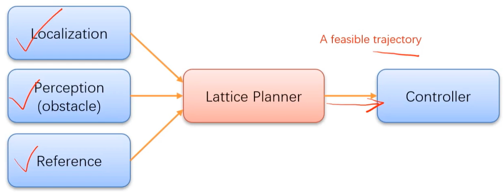

Lattice Planner 输出的轨迹是**一条光滑无碰撞满足车辆运动学约束和速度约束**的平稳安全的局部轨迹


## 算法流程

### 通用场景

[frenet坐标系参考](Frenet坐标系.md)

1. 离散化参考线

2. 将车辆当前位姿信息转换到frenet坐标系下，获得车辆在frenet坐标系的初始状态

3. 基于障碍物信息和速度限制，计算目标距离并获得目标点，获得车辆在目标点位置frenet坐标系下的目标状态

4. 对轨迹状态进行采样，分别是轨迹运行时间t，目标速度v，及到参考线的横向位移d，通过这三个规划参数可以获得采样状态

5. 构建横向位移和纵向位移的多项式规划函数s(t)，d(s)，获得横向位移和纵向位移的规划函数后，进行时间插值就可以获得参考线frenet坐标系下的轨迹点

6. 将轨迹点从frenet坐标系转换到cartesian坐标系，就可以获得物理世界采样轨迹，由于横向和纵向都是通过高次多项式插值获得，以此cartesian坐标系下的轨迹也是光滑的

7. 采样轨迹的碰撞检测、曲率约束及最优轨迹打分：

   采样轨迹是一系列满足速度约束的光滑轨迹，但其还需要满足无碰撞和车辆运动学曲率约束的强制约束，及远离障碍物和靠近参考线等组成的代价约束

   采样轨迹的打分就是为了获得一条最优的满足约束条件的无碰撞光滑轨迹，该轨迹也是lattice输出到controller用于车辆跟随的轨迹


### 实际场景

1. 得到环境的预预测信息，包括动态障碍物的预测轨迹

2. 生成采样的终端状态

   需要根据不同的驾驶场景生成采样的终端状态，主要考虑三种驾驶场景：车道保持、变道和跟车。需要的参数包括：限制速度（用于车道保持时的速度），安全距离（用于跟车时保持的安全距离）。

3. 对采样的终端状态进行评估（一般是对生成轨迹进行评估）

   - 横向偏离惩罚：设置正数权重$W_{\Delta L}$对横向偏差进行加权 $$\begin{aligned} &C_{l a t D e v}=W_{\Delta L}*\Delta \mathrm{L} \ &\Delta L=\operatorname{argmin}*{i}\left(\left|L*{\text {termState }}-{L_{\text {lane }}}_{i}\right|\right) \ \end{aligned}$$
   - 时间惩罚：设置负数权重$W_{\Delta t}$ 使得时间差大的状态能够被优先选择，这样可以使得轨迹更加顺滑。 $$ C_{\text {time }}=W_{\Delta t}* \Delta t $$
   - 终端速度惩罚：设置正数权重 WΔv 使得速度差较小的状态能够被优先选择，这可以使得减少汽车动力损耗。 $$ C_{\text {speed }}=W_{\Delta v}* \Delta v $$

4. 根据终端状态生成轨迹并评估其运动学上的可执行性

   对上一步得到的终端状态进行轨迹生成，并进行筛选，因为一些轨迹的曲率太大或者路径很曲折，这些都是现实车辆无法完成的运动。一般使用轨迹约束处理这个问题，约束项包括最大加速度、最大曲率和最小速度。

   - 最大加速度：约束轨迹加速度小于阈值，可以使得驾驶安全，但会过滤掉一些原本可执行的轨迹。
   - 最大曲率：约束轨迹的曲率小于阈值，使得驾驶行为安全。
   - 最小速度：满足高速公路上的速度要求。

5. 对轨迹进行碰撞评估和筛选最优轨迹

   碰撞检测的实施成本较高，因此一般放在代价评估和轨迹约束之后，最后得到一条最优轨迹。


## 场景示例

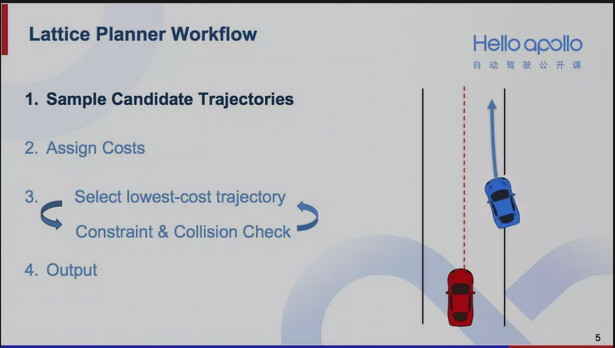

红车是我们的自动驾驶汽车，蓝车是其他障碍车，前面蓝色带尖头的曲线是蓝车的预测轨迹，这是一个前方即将有车辆并入的场景

面对这样的场景，人类司机通常会有多种处理方法，**所以Lattice的第一步就是采样足够多的轨迹，提供尽可能多的选择**，如下图所示：（**1、Sample Candiadate Trajectories**）

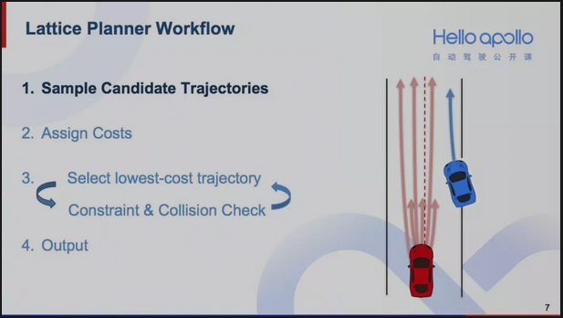

**Lattice的第二步是计算每一条轨迹计算的cost**，这个cost考虑了轨迹的可行性、安全性等因素，具体计算方式会在后面讲到。（**2、Assign Costs**）

在有了轨迹的cost以后，**第三步就是一个循环检测的过程**。在这个过程中，每次会挑选出cost最低的轨迹，对其进行物理限制检测和碰撞检测。如果挑出来的轨迹不能同时通过这两个检测，就将其筛除，考察下一条cost最低的轨迹。（**3、Select lowest-cost trajectory ⟷ Constrain & Collision Check** ）

- 以下图为例，假设首先挑选出cost最低的是深红色较短的轨迹。但我们发现即便猛踩刹车也无法执行这条轨迹。也就是说，这条轨迹超出了汽车的减速度上限。那么它就无法通过物理限制检测，我们会将其筛除

  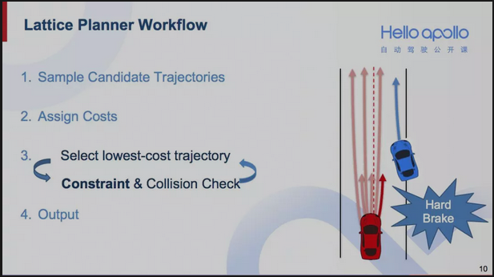

- 假设下一条选出来cost第二低的轨迹是下图中深红色较长的轨迹，会发现若沿着这条轨迹前进，红车会和蓝色障碍车发生碰撞。也就是说，这条轨迹无法通过碰撞检测。于是只能放弃这条轨迹，而考虑下一条cost最低的

  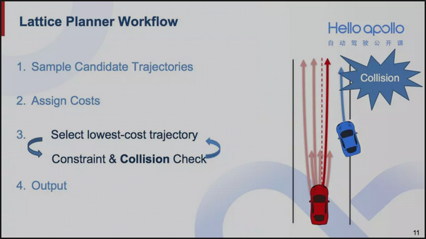

- **这样的过程循环继续下去**，假设现在挑选出下图中靠左边的深红色轨迹，它既符合汽车的物理特性，也不会有碰撞风险。最终，就将这条轨迹作为规划轨迹输出给控制模块

  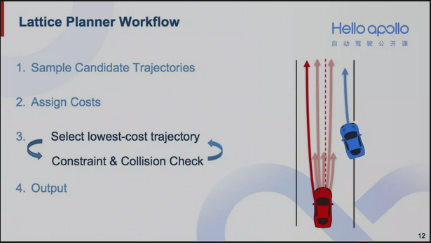


## 轨迹采样

不同于RRT的随机采样，Lattice进行更有规律的采样，分为以下三种：

- 横向采样：根据车道宽度设置横向采样的采样区间，通过横向采样间隔，形成不同的横向采样偏移量；比如下图用左右距离0.5作为横向采样空间，在-0.5、0、0.5处进行采样

  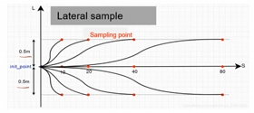

- 纵向采样：通过前瞻点的位移长度s，作为基准采样长度，然后通过对轨迹速度ds进行采样，比如上图用10、20、40、80来设计纵向采样点；若速度较低时，可降低采样频率，变成5、10、20、40

- 时间周期采样：对轨迹的运行周期时间进行采样


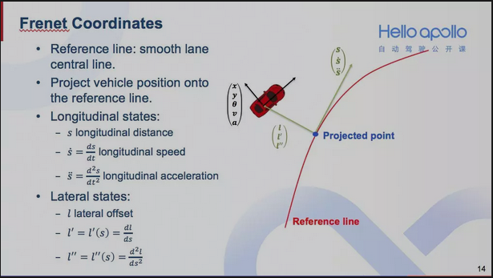

- 那么如何用Frenet坐标系来表示一辆汽车的状态呢？

  首先有一条光滑的参考线（上图中红线），可以按上图所示将汽车的坐标点投影到参考线上，得到一个参考线上的投影点（图中蓝色点）。

  从参考线起点到投影点的路径长度就是汽车在Frenet坐标系下的纵向偏移量，用 $s$ 表示；而投影点到汽车位置的距离则是汽车在Frenet坐标系下的横向偏移量，用 $l$ 表示。因为参考线是足够光滑的，**也可通过汽车的朝向、速度、加速度，来计算出Frenet坐标系下车辆横向和纵向偏移量的一阶导和二阶导**。

  - 这里需要注意的是，我们将横向偏移量 $l$ 设计成纵向偏移量 $s$ 的函数。这是因为对于大多数的汽车而言，横向运动是由纵向运动诱发的。


## 速度规划

有了前面的采样状态，现在需要做的是根据采样状态生成横向 $l(s)$ 和纵向 $s(t)$ 和规划函数，两种规划函数都是通过多项式进行拟合求解生成，多为4、5次多项式拟合，从而满足了车辆运行过程中的一阶导，二阶导联系，也就是速度和加速度连续，保证了轨迹的平滑性要求

对于纵向轨迹 $s(t)$ ，在停车和跟车状态，我们对它的要求更高，故采用五次多项式；但对于巡航状态，由于不需要确定状态的s值，所以只有五个变量，因此用四次多项式即可；对于横向轨迹 $l(s)$​ 也使用了五次多项式进行拟合

- **两种状态下设定的纵向规划函数**

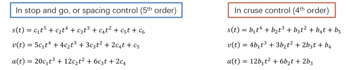

- 在介绍跟车/超车的采样逻辑之前，需要介绍一下**S-T图**的概念

  - 以下图中的场景为例，蓝色障碍车从车道右侧切入，在T_in时刻开始进入当前车道。那么这个场景对应的S-T图就如下图所示。从T_in时刻开始出现一块斜向上的阴影区域。这块阴影区域的高度就是蓝色障碍车的车身长，上边界表示车头，下边界表示车尾，斜率表示车速。

    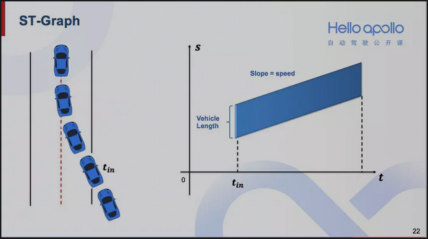

  - 如果上述场景变成这样，障碍车从T_in时刻进入车道，然后在T_out时刻离开车道。那么这个场景对应的S-T图就会缩短，如下图

    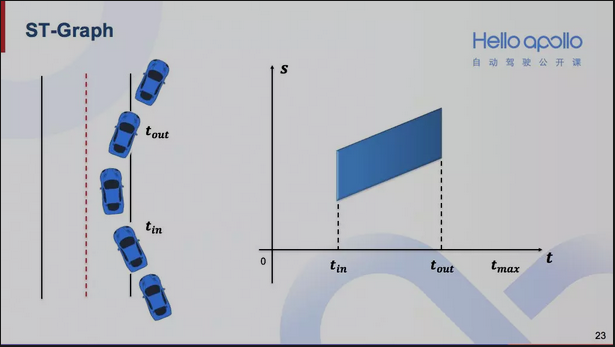

  有了S-T图的概念，观察下图中的两条规划轨迹
  红色的是一条跟车轨迹，绿色的是超车轨迹。这两条轨迹反映在S-T图中，就如下图所示。红色的跟车轨迹在蓝色阴影区域下方，绿色的超车轨迹在蓝色阴影区域上方

  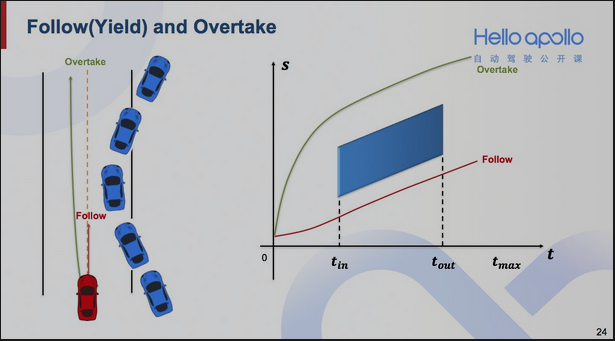

  **采样末状态时，就可以分别在S-T图中障碍物对应的阴影区域的上方和下方分别采样**

  **上方的末状态对应超车，下方的末状态对应跟车**

  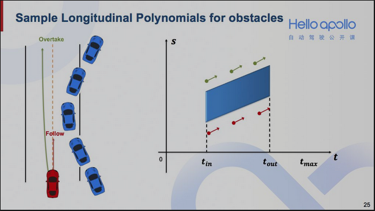

  如果有多个障碍物，就对这些障碍物分别采样超车和跟车所对应的末状态

  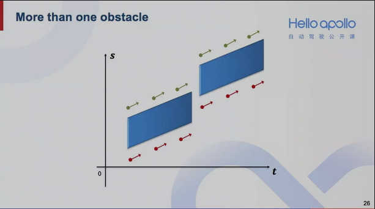

  那么总结下来就是遍历所有和车道有关联的障碍物，对他们分别采样超车和跟车的末状态，然后用多项式拟合即可获得一系列纵向轨迹

  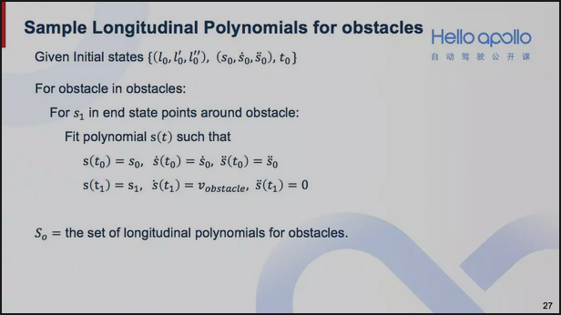

  将三组纵向轨迹组合起来，就可以获得所有纵向轨迹。
  再将所有纵向轨迹和所有横向轨迹两两配对二维合成，就可以完成轨迹采样的工作

  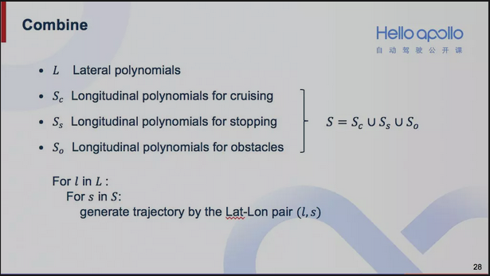

- **停车和跟车状态下的纵向拟合函数求解**

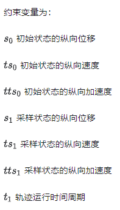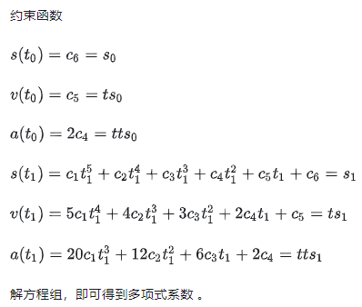

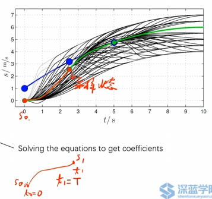

- **巡航状态下的纵向拟合函数求解**

而对于巡航模式，由于采样状态的纵向位移s是变化的、不受约束的，因此少了一个约束条件，因此为了饱和约束，采用了4次多项式拟合

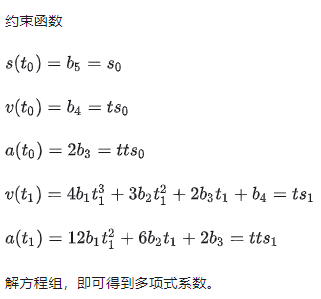

- **横向拟合函数的求解**

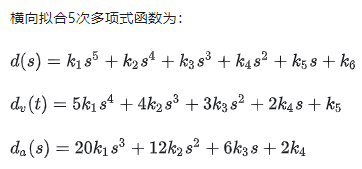

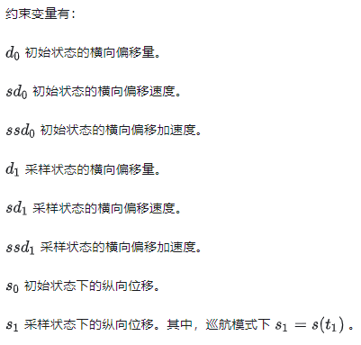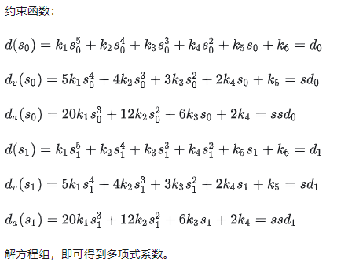


## 仿真结果

如下图所示是仿真测试得到的纵向和横向速度规划曲线：

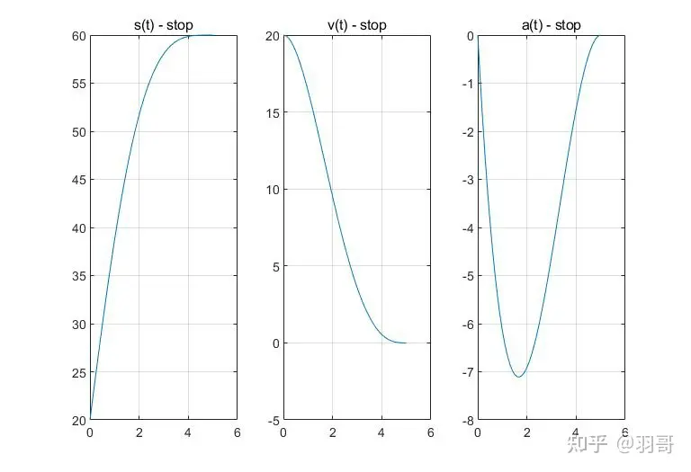

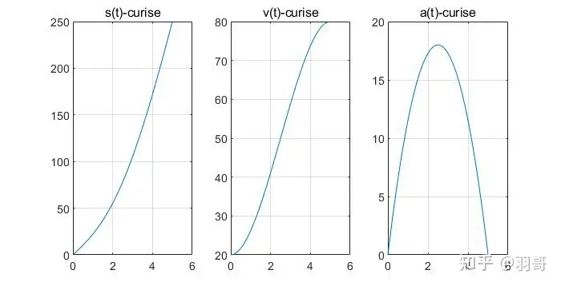

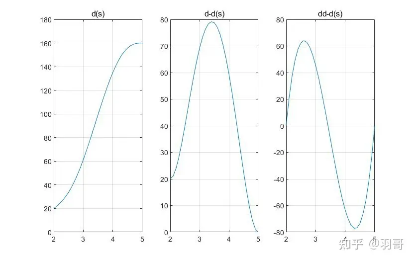

 

## 轨迹生成及轨迹评价函数

- 通过将之前的规划点从frenet坐标系转换到cartesian坐标系，形成控制器可用的采样轨迹

- 接着需要进行目标轨迹的曲率检查和碰撞检测，目的是为了使目标采样轨迹满足车辆的运动学控制要求和无碰撞要求，这样就形成了安全可靠的轨迹簇

- 这些轨迹簇都可以满足车辆的控制要求，但并不是最优的，因此需要从轨迹簇中选出一组最优的运行轨迹。这时就需要引入轨迹评价函数，用来对候选轨迹进行打分

### 轨迹生成

1. 为了生成一条轨迹，第一步就是在Frenet坐标系下采样一个在T1时刻的末状态

   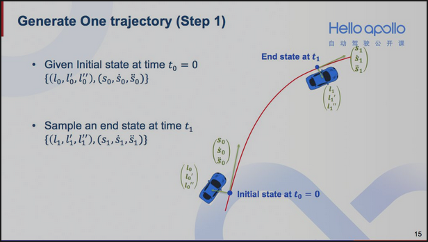

2. 将末状态和起始状态做多项式拟合，分别形成横向（$l-s$）和纵向（$s-t$）的多项式轨迹

   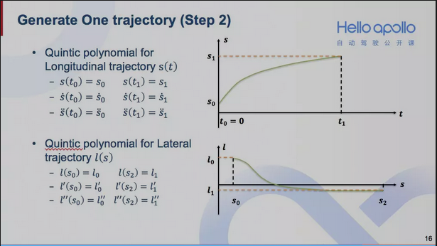

3. 有了横向轨迹和纵向轨迹之后，第三步就是二维合成。给定一个时刻T，可以计算出在T时刻的纵向偏移量和横向偏移量，再通过参考线，即可还原成一个二维平面中的轨迹点。通过一系列的时间点T0，T1，…，Tn，可以获得一系列的轨迹点P0，P1，…，Pn，最终形成一条完整的轨迹

   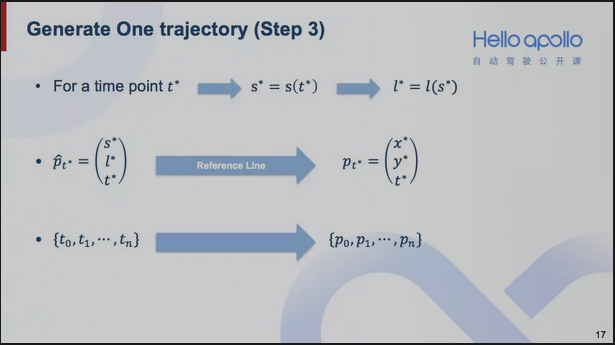


### 轨迹COST实现方法

前面提到，轨迹规划所需要满足的四点要求，分别是到达目的、符合交规，避免碰撞、平稳舒适。针对这四点要求，我们设计了六个cost，cost越高就表示越不满足要求。下面一一介绍这六个cost的设计思路

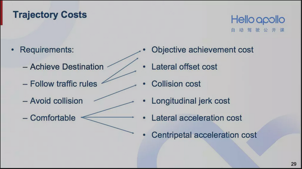

- **首先是到达目的的cost**。分成两种情况，一个是存在停车指令（比如红灯）的情况，另一个是没有停车指令的。如果存在停车指令，相对大的车速，其对应的轨迹cost就越大；如果没有停车指令，那么低速轨迹的cost就会越大。

  例如下图情况：

  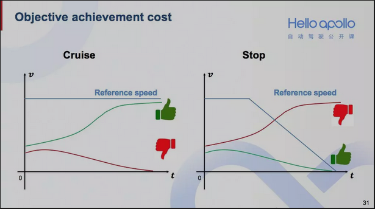

  - 下图蓝线表示没有停车指令时的参考速度。可以看到这种情况下，绿色的加速轨迹会获得一个较小的cost，而红色的减速轨迹会获得一个相对较大的cost。那么如果存在停车指令，参考速度就会想右图中的蓝色曲线一样呈下降趋势。那么这种情况下，同样的两条轨迹，他们的cost大小关系就会正好相反

- **第二个cost是横向偏移cost**。设计这个cost是为了让自动驾驶汽车能尽量沿着道路中心行驶。 那么像下图汽车靠道路一边行驶，和中图画龙的行驶轨迹，他们的cost都相对较高。

  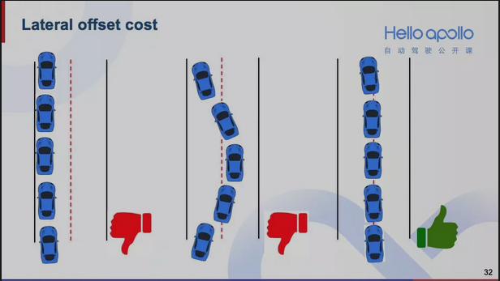

- **第三个cost是碰撞cost**。下图中的两条轨迹，反映在右图S-T图中，我们可以发现红色的轨迹和蓝色障碍车在S-T图中的阴影区域有重叠，说明有碰撞风险，那么它的碰撞cost就会相对较高。而绿色的轨迹在S-T图中反映出来的碰撞风险较小，那么它的碰撞cost就相对较低。

  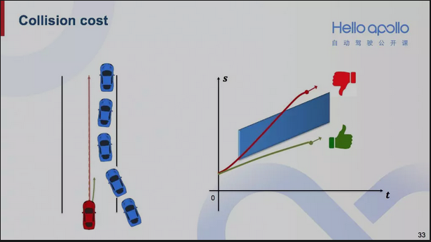

  - 这里介绍一下碰撞检测

    限制检测考察的内容有轨迹的加速度、加加速度、和曲率。碰撞检测则是把自动驾驶汽车的轨迹和其他障碍物的预测轨迹进行比对，观察是否有轨迹重叠

    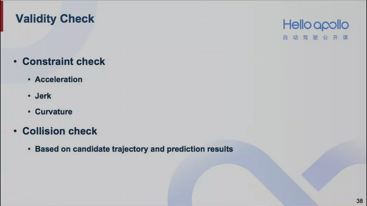

- **第四个cost是纵向加加速度的cost**。 加加速度（$jerk=\frac{d^3 s}{d t^3}$​​）是加速度对时间的导数，表示加速度的变化率。我们用加加速度的最大值来表示这个cost

  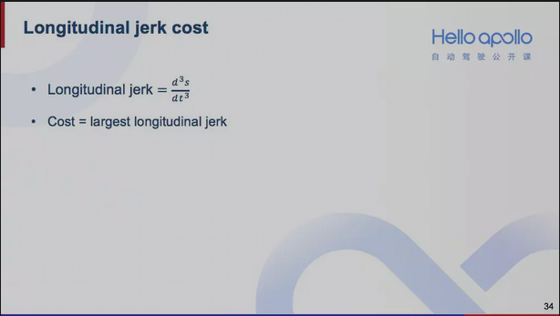

- **第五个cost是横向加速度的cost**。设计这个cost是为了平稳地换道。那么像下图猛打方向盘的轨迹，它的横向加速度cost就会相对较大。

  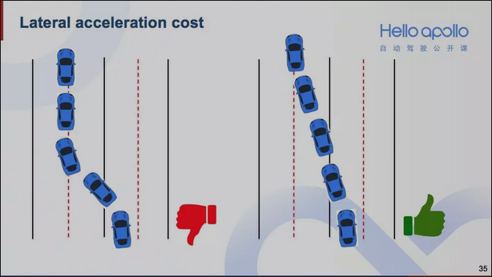

- **最后一个cost是向心加速度cost**。 设计这个cost是为了在转弯或调头的时候能够减速慢行。在弯道处，车速慢的轨迹，其向心加速度cost就会相对较低，那么就会更容易被率先挑选出来。

  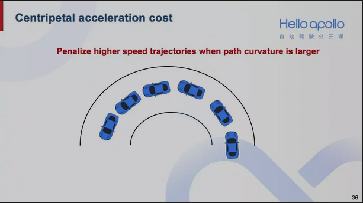

- 这六个cost的加权求和就是轨迹的总cost。可以根据实际的需要，调试这六个权重。


因此最后轨迹评价函数可以通过如下伪代码描述：

```
traj_cost = k_lat * cost_lat + k_lon * cost_lon + k_obs * obs_cost;
```

- 上式中， k_lat : 表示纵向误差代价权重
- cost_lat： 表示纵向误差，综合考虑纵向速度误差，时间误差及加加速度的影响。
- k_lon : 表示横向误差代价权重
- cost_lon： 表示横向向误差，综合考虑了横向加速度误差及横向偏移误差的影响。
- k_obs : 表示障碍物代价权重
- obs_cost： 表示障碍物距离损失

最后选择出代价值最好的一条轨迹输入到控制器，用于控制器的跟踪控制
