# OpenPlanner

论文原文：[OpenPlanner论文](E:/无人车项目/github仓库/lwb/书籍论文/OpenPlanner.pdf)

**OpenPlanner是在Autoware开源自动驾驶框架中的规划算法**，区别于相对简单的A*等

OpenPlanner作为Autoware框架的一部分，Autoware是由名古屋大学开发的一个开源自动驾驶框架，其基于ROS，即Autoware是一系列ROS包的集合

它是通过对全局路径进行采样生成一系列的候选路径，结合矢量地图、传感器信息以及碰撞、交通规则等约束和优化目标，选择出最优的运动轨迹

OpenPlanner由**全局路径规划器（`global path planner`）**、**行为状态生成器（`behavior state generator`）**和**局部规划器（`a local planner`）**组成

OpenPlanner需要一副地图和一个目标位置来计算全局路径，并在避开障碍物的同时规划局部路径。它还可以触发一些其他行为，比如在红绿灯前停车

全局规划器在考虑地图中标注的交通成本后，会生成一条平滑的全局路径作为参考

依据参考，局部规划器生成平滑、无障碍的局部轨迹，轨迹跟踪器使用这些轨迹实现低水平控制

行为状态生成器负责处理一些情况如：路径跟踪、对象跟踪、障碍物回避、紧急停车、在停止标志前停车和红绿灯场景等等

## 基本介绍

OpenPlanner的框架如下图所示：

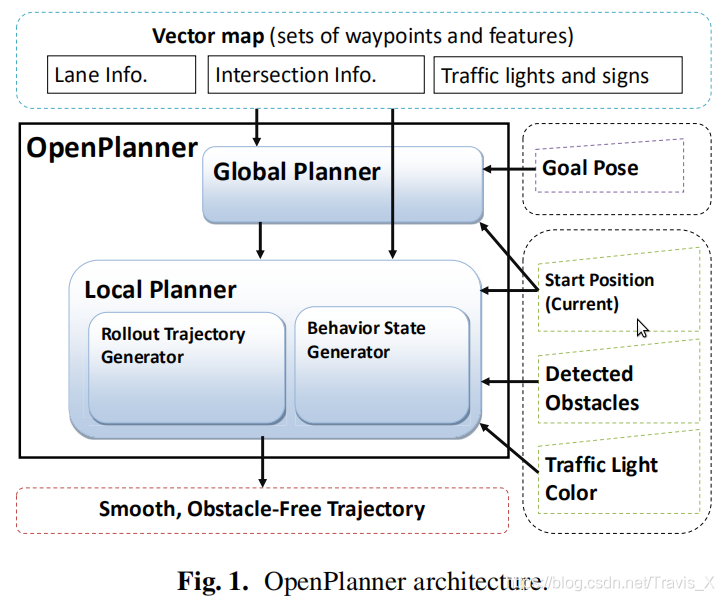

它包含一个从矢量地图生成全局参考路径的全局规划器；

然后，系统使用这个全局路径从一组采样的`roll-outs`中生成一条无障碍地局部轨迹；

在规划器的中心，行为生成器使用预先设置的交通规则和传感器数据作为协调器，进行碰撞和交通规则的cost计算；

最终选择最佳轨迹，并重新规划命令和速度曲线

## 相关工作

### Global Planning

全局规划通常去计算起点到终点的路径（以满足设置的优化函数），例如Dijkstra算法中的距离约束；A star会使用启发函数，Anytime Dynamic A star和D star会使用叫做replanning的方法；维诺图会计算无碰撞路径；

上面提到的算法都是基于用传感器更新的栅格地图，也称为cost map。这些算法基本是服务于unstructured environments（非结构化环境，即没有明显道路信息），如停车场和越野导航

**另一种全局轨迹规划是服务于绵延数公里的structured roads（结构化道路，即含有丰富的道路信息，如车道线）。在这种规模的环境中，cost map变得不切实际，所以需要本文如OpenPlanner这种算法**

- 结构化的环境信息可以使得规划全局路径更加丰富，包括道路接环、十字路口的选择、处理stop sign、交通灯和停车
- 对于结构化环境的规划，**矢量地图必不可少**

### Behavior State Machine

除了路径规划外，另一个重要功能就是任务规划，也称作行为生成，**通常使用状态机（state machine）来表示任务**，并且利用一些规则去切换状态

在一些研究中，会连续的驾驶行为状态转化为离散的状态空间，然后利用搜索算法在symbolic space中获得最优任务序列，以达到目标

### Local Planning

一些局部路径规划算法，如势场法；以及一些避障算法会将车辆约束考虑进去；近年来越来越多的规划期将人为因素、乘客舒适度考虑进去

## 系统概述

### Global Planner

将矢量地图、起始位置、目标位置（vector map, a start position and a goal position）作为输入，然后使用dynamic programming（动态规划）去得到最短并且cost最小的道路

OpenPlanner使用的全局规划器可以支持复杂的矢量地图，但是在文中的实验中，仅仅在图中绘制了如红绿灯、停车线这类基本的交通信息

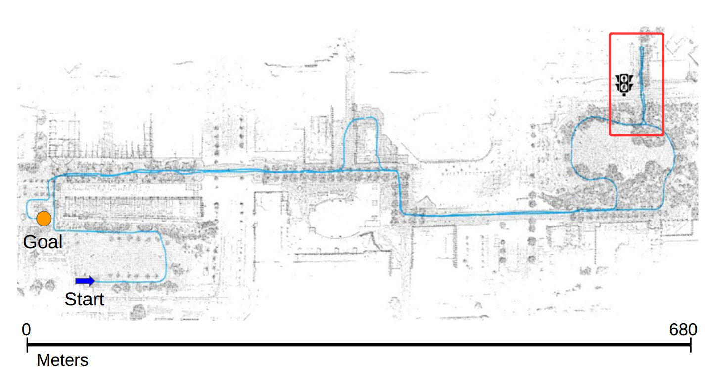

### Behavior State Generation

OpenPlanner的 behavior state generation module作为系统的决策者，它是一个有限状态机，每个状态代表一个交通状况

状态之间的切换受到一些参数控制，这些参数是由交通信息和预先设置的交通规则计算得来的。下面的图展示了OpenPlanner系统中可用的状态

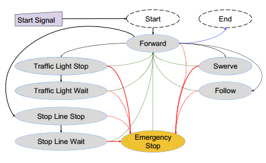

### Trajectory Generation

local path planner的输入是global reference path（之前生成的全局路径）和current position

然后，会生成几条称作`roll-outs`的参考路径，局部规划器会选择一条cost最小的轨迹。

下图展示了有7条roll-outs的情况：（ 这个方法是基于斯坦福大学的一个办法，改进而来）

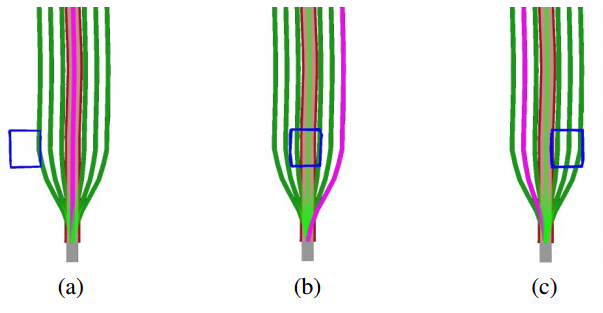

## Global Planner

OpenPlanner使用矢量地图（vector map）作为全局规划器的主要输入，为之后局部规划器生成roll-outs提供一条reference path

### Vector Map

自动驾驶导航中最广泛使用的方法之一是使用矢量地图，有时候也被称作高清地图（HD map，high definition），区别于地理信息系统（GIS）中用到的地图，如open street maps

下表展示了矢量地图通常包含的元素：

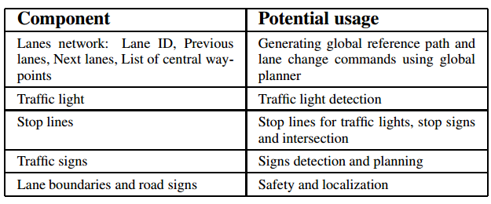

- OpenPlanner使用的是2.5D的map，意思是它只包含需要时才使用的海拔信息。这可以提高规划的性能，因为大部分规划都是在2D维度中完成的，但是3D信息在一些情况也很重要，比如陡峭的爬坡

用高阶多项式去表示矢量地图中的车道可以帮助我们在插值时满足足够的points密度，但是缺点就是计算量大

如果地图只从文件中加载一次，则不会有其他问题。但是如果地图是从地图服务器（map server）中加载，这会减慢规划过程。为此，开发了一种有效的算法来调整车道中心线的密度，如下图伪代码：

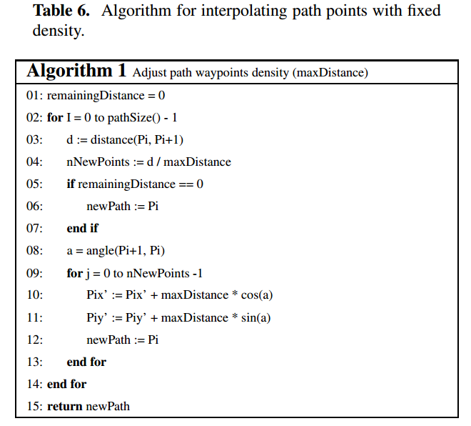

该算法通过在固定距离的路径上插值点来修正矢量图原始数据中的误差，具体做法为：**通过设置一个`maxDistance`来控制$P_iP_{i+1}$段需要插值几个点（$d/maxDistance$​）**

具体的插值方法为：先计算$P_{i+1}P_i$连线的角度$a$，然后根据之前算出的插值点数，每个插值点的坐标通过前一个点的$xy$坐标分别加上$maxDistance$去乘以$cosa$或$sina$

下面展示了两幅用到的矢量地图，可以简单或者复杂：

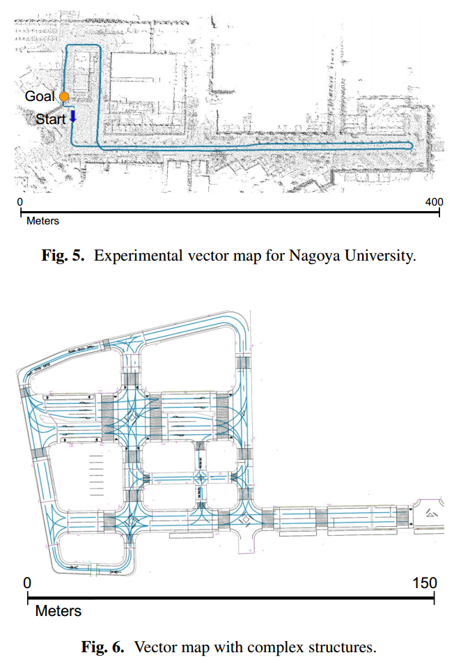

### Global Planner

前面提到了规划通常分为两种：非结构化道路和结构化道路的规划

本文应用在结构化环境中，必须遵守交通规则，例如：在车道中心行驶，向正确的方向行驶，只有在允许的情况下才切换车道，进入正确的车道右转或左转

在使用动态规划的时候，我们从起始位置开始朝着目标点去trace可能的路径，在trace的过程中，我们按照指定的规则去构建一个tree of possible paths；一旦我们达到goal，就从目标点向着起点trace back回去，同时一路标记道路信息（局部规划器生成局部路径时需要这些信息，局部规划器需要知道交通方向、变道位置、停车线位置、交通灯位置和速度限制）。

- 整个过程如下图所示：

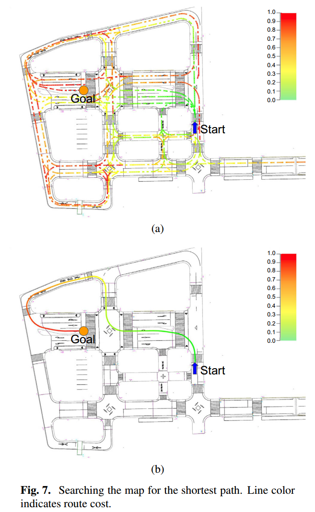

- OpenPlanner产生Global Path的算法如下图所示：

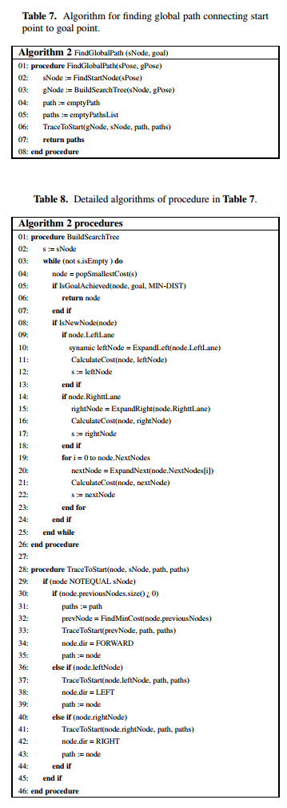

简单来说，跟之前的叙述一致，整个过程分成两个部分：BuildSearchTree和TraceToStart

- 在建立tree的过程中，就是不断向前或者向左或者向右去延申Node，每次延申的Node要同时计算其cost，将Node存入列表中；每次循环开始，会取出列表中cost最小的Node，并判断这个Node是否是Goal，不是的话，就继续向前向左或向右延申.....
- 回溯起点的过程，其实就是建立tree步骤倒着来：也是分成直着、向左、向右三种情况，每种的处理都一样，先找到上一个cost最小的节点，然后这样一个个向前找

## Local Planner

局部规划器生成的平滑轨迹可以被跟踪算法（如pure pursuit）track

在OpenPlanner中，我们使用生成`roll-out`的方法。因为这种方法可以允许behavior generator在任何时候要求重新生成（re-plan）新的、平滑轨迹

### Roll-Out Generation

根据矢量地图生成的全局路径作为参考**生成一系列平滑的候选路径**

用于实时规划，最大的处理时间是0.1s，这样后续的控制器才能快速改变速度

- 算法输入：当前的位置（current position）、规划距离（planning distance）、roll-outs的数量、下一段全局轨迹（the next section of the global path，就是在这一截global path上去局部规划）

- 算法输出：n条平滑的轨迹（可以从车辆中心位置行驶到最远的规划距离位置）

roll-outs的采样过程可以分成三个部分，如下图所示：

1. **car tip**：**从车辆中心到横向采样点的距离**，其长度决定了车辆切换到不同轨迹的平滑度

2. **roll-in**：**表示横向采样的范围**，其长度与车辆速度成正比；车辆行驶的速度越快，此区域产生平滑变化的时间就越长

   **直接横向采样（Straight-forward lateral sampling ）是沿着和全局路径垂直的方向移动一个固定的距离来完成的，这个距离被称为roll-out density**

3. **roll-out**：这一段的长度是横向采样的结束点位置到局部路径的末尾

- **roll-in段横向采样示意图：**

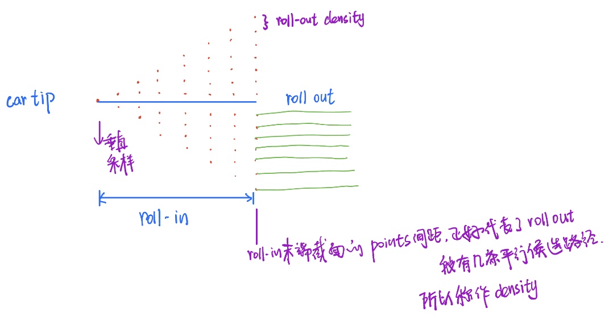

- **局部轨迹规划算法生成roll-outs包括三个主要步骤：**

1. 根据车辆的当前位置和最大规划距离从全局路径中提取所需的部分（表示并不是对整个global path做规划）
2. 对提取的全局路径段，进行垂直方向的路径点采样。采样从car tip的末尾开始，横向距离为零，然后逐渐增加直到满足roll-out density（这个density是利用roll-in末端截面的采样点计算出的）
3. 使用共轭梯度平滑每条采样轨迹，这是一种非线性迭代优化技术，消除了采样步骤导致的roll-outs不连续；这也改善了曲率，从而导致更平稳的转向

轨迹顶点（路径点）的密度（每条trajectory的points 密度）使用分段插值来调整，和上面讲到的Table 6中的Algorithm的方法一样

许多参数插值技术对输入噪声很敏感，并且会直接影响到输出。例如，cubic splines（三次样条）在输入的点之间的间距很近时，容易造成任意大的震荡。**所以，我们使用分段插值和共轭梯度平滑的组合去省城平滑轨迹。由于我们使用的是矢量图，所以结果产生的轨迹通常是运动学可行的，因此我们假设所有生成的轨迹都是运动学可行的**

- **下图为Roll-Out Generation的步骤：** 

其中：(a)原始地图，(b)从全局路径中提取路径段，(c)采样，(d)使用共轭梯度平滑

- roll-out生成代码如下图所示：

  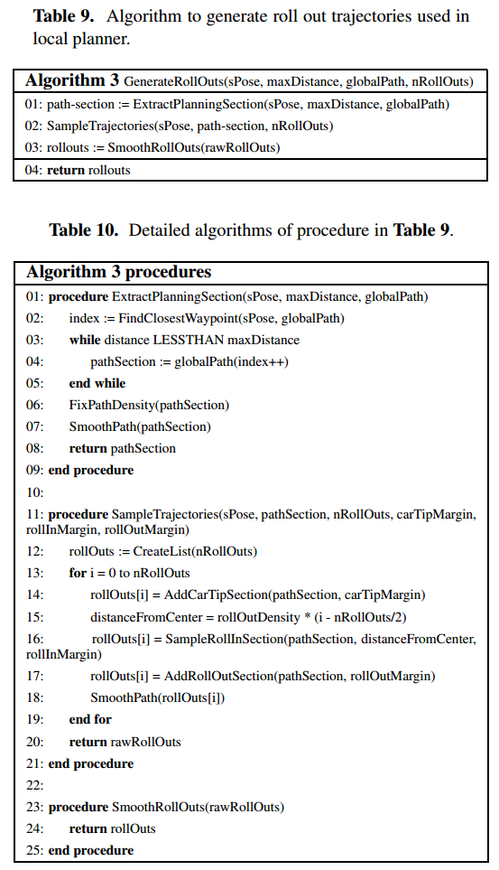

- 其实就是跟上面的叙述一样，procedure分成三部分：

  （1）在提取感兴趣路径的阶段，通过`maxDistance`这个参数确定用于规划的总长度；然后在global path的这一段中，从当前pose开始，不断找下一个最近的路近点（Closest Waypoint），并保存它们的index，最后返回这一系列index

  （2）在采样阶段：就是按照预先设置的三段长度（根据车速或路况提前设置car tip、roll in、roll out段的长度），分别确定第一步中的一系列index，哪一部分属于Car Tip，那一部分属于Roll in，哪一部分属于Roll out。在确定Roll in段的时候，额外进行了横向的采样（根据参数`distanceFromCenter` ）

  （3）最后就是一步平滑

### Cost Calculation

除了roll-out generation，局部规划器的另一个重要功能是车道内的障碍物规避，或者说迂回（swerving）

避障过程是在 利用Table 9算法生成的roll-outs中选择最佳的可能轨迹

- 输入：roll-outs和检测到的障碍物
- 输出：可选择的轨迹

我们使用一个附加成本函数来评估每个轨迹，它计算三种成本（three different normalized cost measurements）：优先级成本，碰撞成本和切换成本，在其中选择最小的一个

- 障碍表示：
  1. 边界框：可以显著提高障碍物的检测性能，但以牺牲准确性为代价
  2. 点云数据：大大提高了检测精度，但性能大幅下降

**因此我们通过只使用点云簇的轮廓点样本（a sample of the contour points from the clusters of point cloud data）来解决这个权衡问题，每个障碍最多有16个点。**

轮廓点的最大个数是局部规划器的参数之一，通过增加这个个数，我们可以得到更精细的表示，从而实现更精确的避障

下图显示了使用8个轮廓点的障碍物检测示例。轮廓形式障碍物的计算分为三个阶段：

- 首先，将 $xy$ 平面划分为n个扇区;
- 其次，求出各点到中心点的距离和角度，并利用角度将相应点划分进对应的扇形;
- 最后我们选择的轮廓点是：距离每个扇形中心最大距离的点，如下图所示：

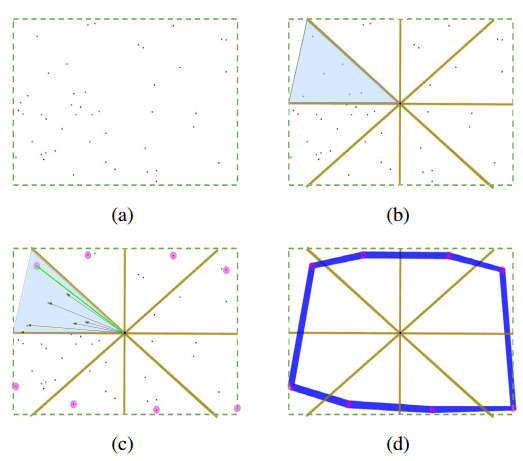

图中，障碍物形式仅使用点云数据簇的轮廓点

1. 在(a)中，我们显示样本中所有的随机点云点
2. 轮廓计算的第一步如图(b)所示：我们找到点云的中心点，从这个点开始我们把点云分成8个四分之一扇区，四分之一是一个参数，可以改变它来得到更高分辨率的轮廓
3. 在(c)中，我们展示了该过程的第二步，对于每个扇区，我们计算中心和属于该扇区的每个点之间的欧氏距离，然后我们找到距离最大的点
4. (d)显示的是每个四分之一点的最终轮廓结果

#### Center Cost（Priority cost）

限制车辆始终沿着车道的中心行驶：是对每条候选路径进行分级，中心路径的优先级是最高的，然后由中心路径向两边递减，这是为了在没有障碍物的情况下，让车辆保持在中心路径

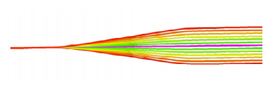

计算方式：每条roll-out都使用与车道中心轨迹的绝对距离计算

#### Transition Cost

限制车辆不会频繁在roll-outs中变道，这有助于更平滑的行驶

计算方式：现在所在的轨迹和其他roll-outs的垂直距离

#### Collision Cost

碰撞代价的计算**分为两个阶段**来计算，从而提高性能：

- 在第一阶段，我们计算障碍物轮廓点（ obstacle contour points）到每条生成轨迹的距离来test每条轨迹

  由于所有的轨迹在roll-out（第三段平行的）都平行于中心轨迹，我们不必在roll-in段后应用显式测试（explicit test）

  第一阶段的障碍物测试使用“**圆内点方法**”（point inside a circle test）实现：每个障碍物轮廓边缘提供测试点，圆的圆心是路径点，每个圆的半径是车辆宽度的一半加上检测误差幅度

  - 对point inside a circle test的理解：（1）每个轮廓提供测试点；（2）圆的中心是路径点way-points；（3）半径是一半车身宽+检测误差；**以路径上的路径点画很多圆，然后判断轮廓提供的测试点是否落在这个圆里面**

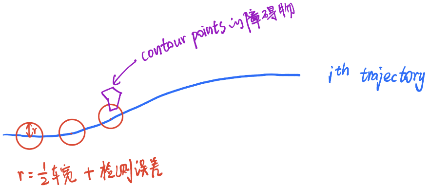

**网上博客有这么一个说法，第一阶段只是一个障碍测试，不去计算精确的cost。即一旦有轨迹在圆内，那么这条轨迹直接被排除**

- 在第二阶段，计算roll out部分的cost。因为在roll out段，所有的轨迹都是平行的，所以不用麻烦地去一条条计算轨迹的cost。而是可以巧妙处理：

  首先只计算障碍物的轮廓点到中心轨迹的距离，然后再计算两侧平行轨迹的cost，技巧就是：

  - 利用两侧轨迹和中心轨迹的的signed distance来计算。这里signed distance的意思我的理解是：一个带有正负号的距离
  - 例如：定义中心轨迹的左侧距离为正，右侧距离为负数。那么两侧轨迹的cost可以在中心轨迹的cost上直接加上这些有正负的距离来得到

  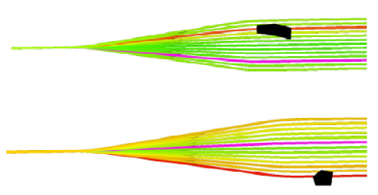

## Behavior Generation Using State Machine

参照一个预先设置的状态切换表格去切换状态：

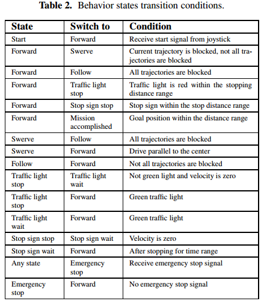

有几个参数控制状态之间的转换

从理论上讲，概率方法应该导致更平滑的转换，但是在广泛的应用程序中实现和维护它更慢，更复杂。**所以，论文中引入 timers 和 counters**

例如，当离障碍物的距离接近阈值时，`the behavior generator`会将车辆状态在swerve 和follow之间快速转换。然后counter and timer会帮助打破这个循环切换的模式

另一种情况：当交通灯从红变到绿，当light detector不够可靠去处理这个change时，这时就需要多次接收signal来保证信号灯状态的可靠性，并切换车辆状态。所以在初始化`the behavior generator`的时候，我们会设置minimum transition time，因此，除非经过一定的时间或遇到紧急状态情况，否则状态将保持

## 实验

本文的最后一节，描述了OpenPlanner在两个实际场景的实验结果（ the campus of Nagoya University、 the Tsukuba RWRC event）

这里不去赘述实验的细节，就是在这里放一张OpenPlanner的参数表，这些parameters也是这个算法在应用时，最需要和你自己环境做适配的：

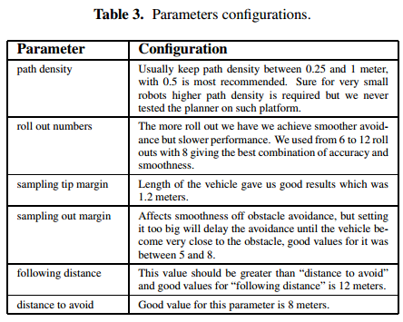

- path density —— 也就是最后平行段的每条roll out间距（太大可能会影响变道时的流畅，太小可能失去了变道的意义）。一般设置0.5m左右
- roll out numbers —— 最后平行段的roll out总数，一般推荐8条（即一共8条可切换的轨迹）
- sampling tip margin —— Car tip段的长度，一般推荐1.2m（按照车体长度调整）
- sampling out margin —— Roll out段的长度，一般设置5-8m
- following distance —— 跟随障碍物的距离，一般设置12m，即距离障碍物12m外，不会实行超车或者变道，只会跟随**（这个参数值要大于distance to avoid）**
- distance to avoid —— 开始避障的距离，一般设置8-10m，即距离障碍物这个距离就开始规划避障轨迹！

还有一些源码里有的参数，例如：

| Parameter                         | Configuration                                                |
| --------------------------------- | ------------------------------------------------------------ |
| Lateral Safety                    | 横向安全距离，建议设置1-2m，表示避障时和障碍物的最小横向距离 |
| Distance to closest lane          | 多近之内的waypoint算数                                       |
| Prediction distance               | 预测的距离，默认25m其实算远的，一般看激光雷达的最远测距      |
| Enable Particle Filter prediction | 开启粒子滤波预测，但是肯定会减慢规划速度                     |
| Plan Distance                     | 局部规划的最远距离（就是从global path上截取的感兴趣长度），默认是80m，但是由于传感器的限制，40m应该比较合适 |

### 实验细节

1. OpenPlanner可以运用到复杂的环境，论文中就展示了一个实车测试的场景，是小车通过狭窄车道（由密集障碍物组成的）：

   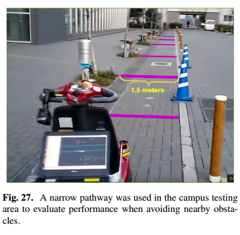

   对于这个场景（在桩桶和树木之间的行驶会产生很多方向的变化），实验也是用了两组不同的参数去测试最后的规划效果：

   - 使用最小的roll-in margin，小车的转向非常迅速但是不平稳；

   - 使用较长的car tip和roll-in margin，输出的轨迹会更平滑

2. 在Tsukuba RWRC Experiment中，对小车最复杂的一个要求是，必须进行一个非常狭长的U型转弯：

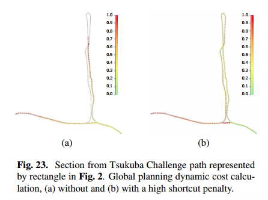

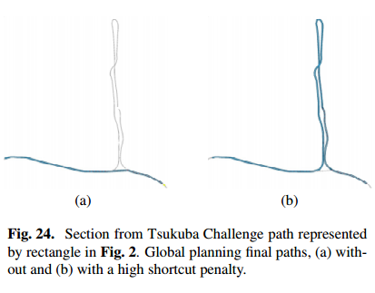

- 图中，左右是两种规划结果，产生差异的原因是Cost设置的不同：

  （a）图：规划器的默认行为是寻找从当前位置到目标的最短路径，所以正常的路径选择会是很短的一截；但是这不符合实验要求；

  （b）图：因此论文中对这个场景增加了与捷径相关的成本（with a high shortcut penalty）

  在Fig.23.中，彩色比例尺的意义：绿色是较小的cost路径，红色越深表示cost越大的路径。最后小车会沿着更绿的路径行驶

## 结论

OpenPlanner能够通过复杂的矢量地图规划轨迹，并在动态环境中导航，同时处理各种离散行为，例如在停车标志和交通灯前停车，以及避开障碍物

无需进一步优化，即使障碍物数量增加到100个左右，OpenPlanner也能以超过10hz的速度实时运行

OpenPlanner还可以生成非常平滑的轨迹，从而实现更平滑的控制