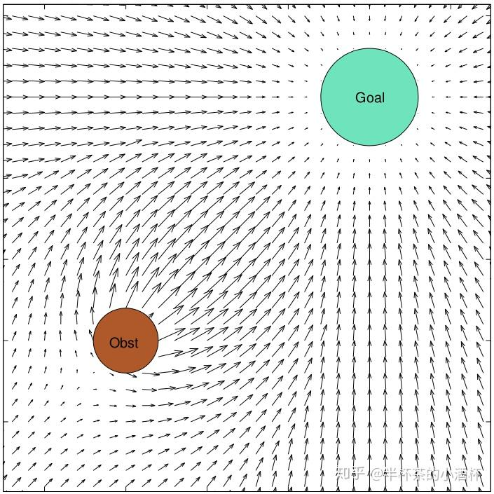
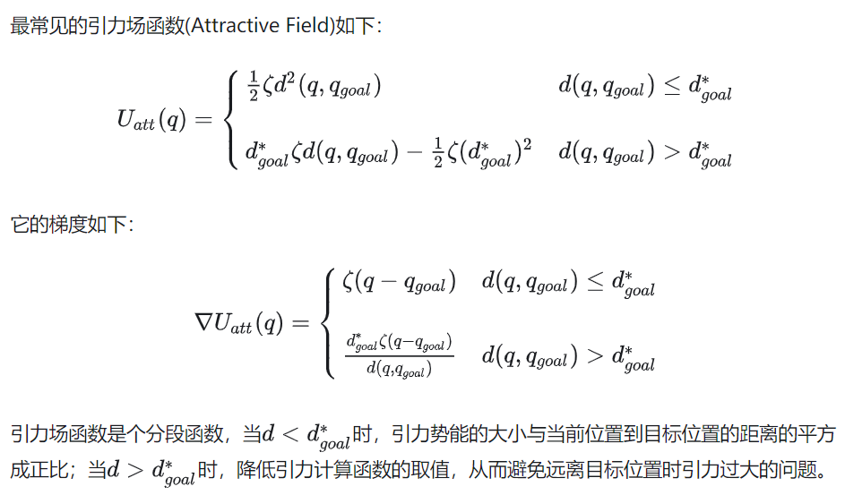
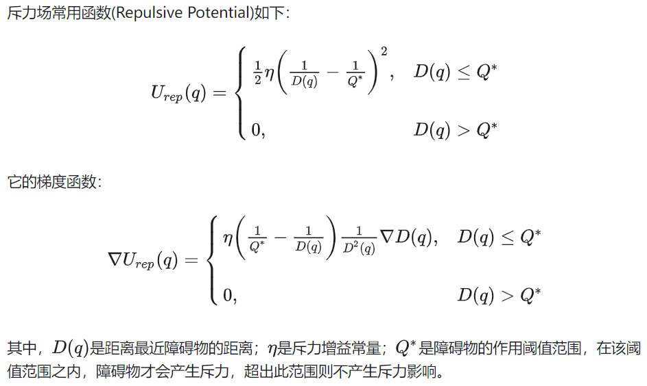
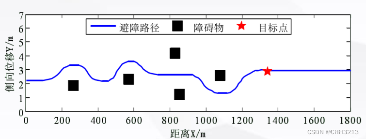
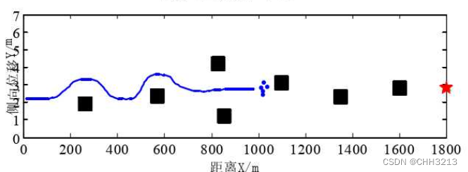
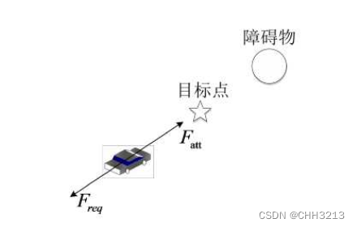
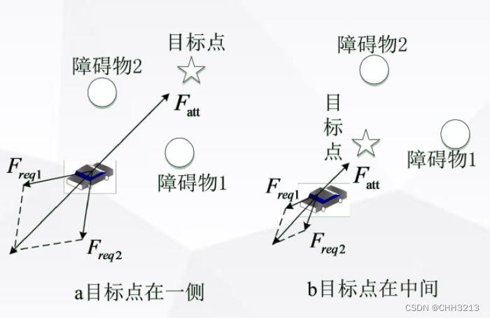

# 人工势场法

## 总述

应用在机器人避障领域

该算法将**目标**和**障碍物**分别看作对机器人有**引力**和**斥力**的物体，机器人沿引力与斥力的合力来进行运动，搜索无碰的避障路径，类似于物理学中的电磁场

更直观而言， 势场法是将障碍物比作是平原上具有高势能值的山峰， 而目标点则是具有低势能值的低谷

## 引力场和斥力场

人工势场包含两种两种力场：运动目标位置所形成的引力场(Attractive Field)和障碍物所形成的斥力场(Repulsive Field)，合力势场总函数为：
$$
U(q)=U_{att}(q)+U_{rep}(q)
$$
其中，$U_{att}(q)$是引力场，引导机器人向目标位置移动；$U_{rep}(q)$是斥力场，引导机器人避开障碍物

## 算法缺陷

### 目标不可达

由于障碍物与目标点距离太近，当汽车到达目标点时，根据势场函数可知，目标点的引力降为零，而障碍物的斥力不为零，此时汽车虽到达目标点， 但在斥力场的作用下不能停下来，从而导致目标不可达的问题

### 陷入局部最优

车辆在某个位置时，无法向前搜索避障路径

主要有两种原因

1. 汽车受到的障碍物的斥力和目标点的引力之间的夹角近似为180°，几乎在同一条直线上,就会出现汽车在障碍物前陷入局部最优的问题

2. 若干个障碍物的合斥力与目标点的引力大小相等、方向相反，则合力为0，智能汽车自身判断到达势能极小值的位置，但没有到达期望的目标点位置

   由于合力为零，汽车就会陷在势能极小的位置，无法继续前进和转向，以致无法到达期望的目标点

## 解决方案

### 改进障碍物斥力势场函数

改进障碍物**斥力势场函数**来解决局部最优和目标不可达的问题；在传统人工势场法的障碍物斥力场模型中**加入调节因子**，使汽车只有到达目标点时，斥力和引力才同时减小到零，从而使局部最优和目标不可达的问题得到解决

### 道路边界斥力势场

通过建立道路边界斥力势场以限制汽车的行驶区域，并适当考虑车辆速度对斥力场的影响

