# 快速探索随机树算法(RRT和RRT*)

## RRT

### 总述

- **传统算法**：人工势场法、模糊规则法、遗传算法、神经网络、模拟退火算法、蚁群优化算法等**都需要在一个确定的空间内对障碍物进行建模**，计算复杂度与机器人自由度呈指数关系，不适合解决多自由度机器人在复杂环境中的规划

- **RRT**：**对状态空间中的采样点进行碰撞检测，避免了对空间的建模，能够有效地解决高维空间和复杂约束的路径规划问题**

  **通过随机构建空间填充树来有效搜索非凸，高维空间的算法**

  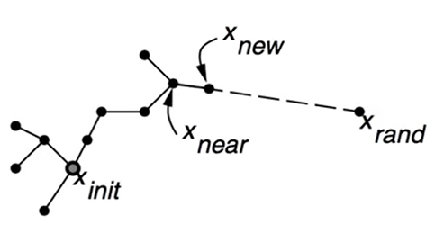

### 算法流程

- 核心思想：将搜索的起点位置作为根节点，然后通过随机采样增加叶子节点的方式，生成一个随机扩展树，当随机树的叶子节点进入目标区域，就得到了从起点位置到目标位置的路径

伪代码如下：

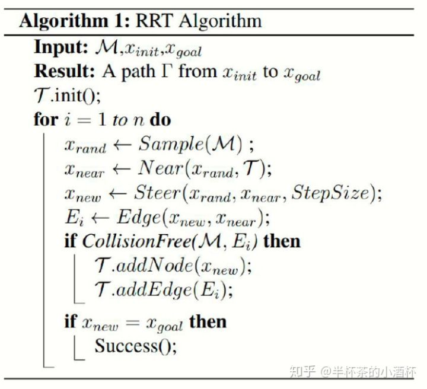

- 输入：$M$ 为地图环境，$x_{init}$ 是起点，$x_{goal}$​ 是终点

- 从起点开始，在途中进行随机采样撒点 $x_{rand}$​

  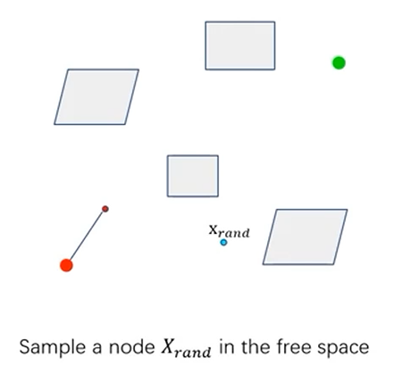

- 通过 $Near$ 这个函数查找距离 $x_{rand}$ 最近的节点 $x_{near}$​

  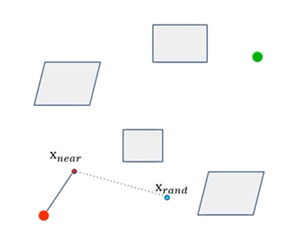

- 沿着 $x_{near}$ 到 $x_{rand}$ 的直线方向前进一个步长 $StepSize$（可自己定义） 的距离得到 $x_{new}$ ，即为真正打算走的节点

  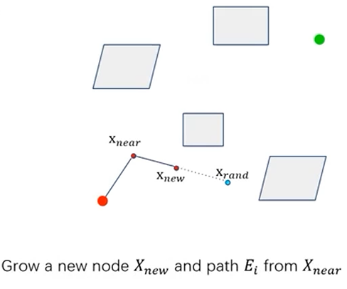

- 判断能否从 $x_{near}$ 走到 $x_{new}$ ，即考虑该两点之间是否满足约束条件（比如中间有障碍物等）。若满足，则加入轨迹；若不满足，则舍去

  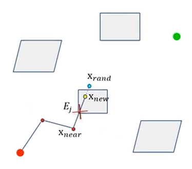

- 如果没有碰撞，则重复上述空间搜索。判断是否达到最大次数或是否达到终点

  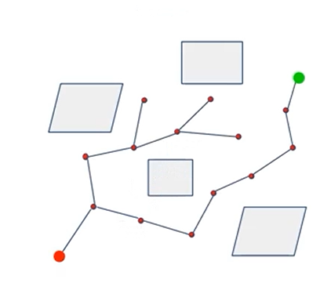

- 返回路径

  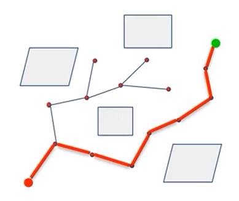

### 总结

- 优点
  1. 容易实现
  2. 相对于PRM，对终点更具有针对性
- 缺点
  1. 不是最优路径
  2. 在整体空间采样，算法不高效
  3. 曲线不连续

## RRT*

### 总述

**解决RRT算法难以求解最优可行路径的问题**

它在路径查找的过程中持续优化路径，随着迭代次数和采样点的增加，得到的路径越来越优化。迭代的时间越久，就越可以得到相对满意的规划路径

### 算法流程

RRT*与RRT的区别在于以下两点：

1. **Rewrite的过程，即为 $x_{new}$ 重新选择父节点的过程**
2. **重新布线以减少整体的路径成本**

伪代码流程如下：

- $x_{rand}$ 、$x_{near}$ 、$x_{new}$​ 三点的寻找方式不变

  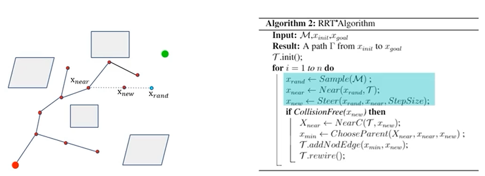

- 父节点的更换

  在以 $x_{new}$ 为圆心，r为半径组成的圆内，寻找所有潜在的父节点集合（举例为$x_{near}$、$x_1$、$x_2$ 三点），则分别**计算他们三点自身代价与距离 $x_{new}$ 代价之和，将 $x_{new}$ 的父节点更新为集合(A、B、C)中最小的那个点**

  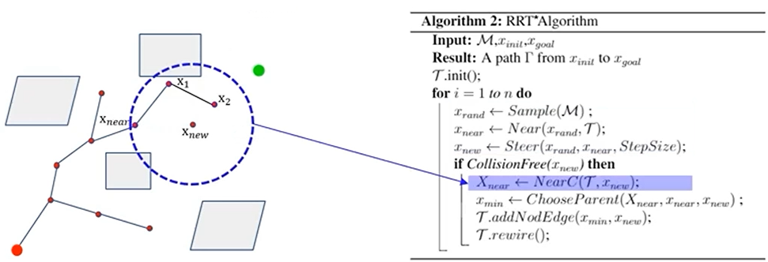

- 此处发现还是从 $x_{near}$ 到 $x_{new}$​ 的距离短，故加入集合中

  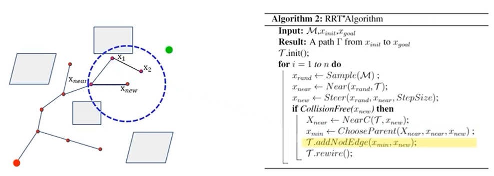

- 再对此处的 $x_1$、$x_2$ 的父节点进行寻找

## 碰撞检测

一个不规则的障碍物，可以对其作膨化处理，碰撞条件更加松弛。

例如将圆形变成正方形，看看他们是否相交。也可以将新生成的轨迹与某图形进行碰撞检测，这样问题就变成了几何问题。

如果把障碍物抽象成长方形，则可以用 与 $x_{near}$ 与 $x_{new}$​的连线与长方形的边是否相交

还可以通过斜率来进行检查

## 曲线优化

因为由RRT*算法得出的曲线并不连续，可采用以下插值拟合方法来优化曲线

- dubins 曲线
- RS 曲线
- 样条插值曲线

## RRT*的优化

- 思想：靠近目标，引导树向空旷的区域探索
- 偏置采样：sample 偏向终点
- 采样拒绝：拒绝不好的样本
- 剪枝：即将碰撞的情况
- 图稀疏化
- 降低碰撞检测概率：提前扫图，将障碍物附近的方向的采样概率降低