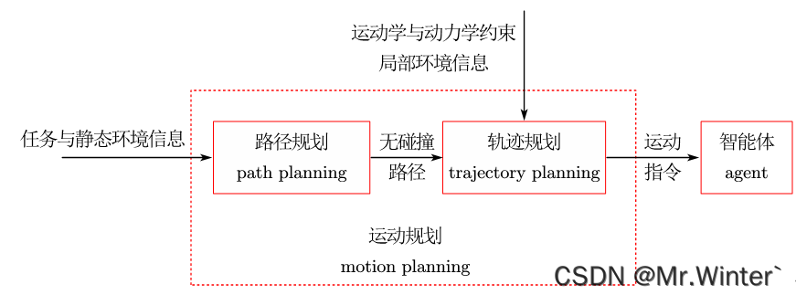
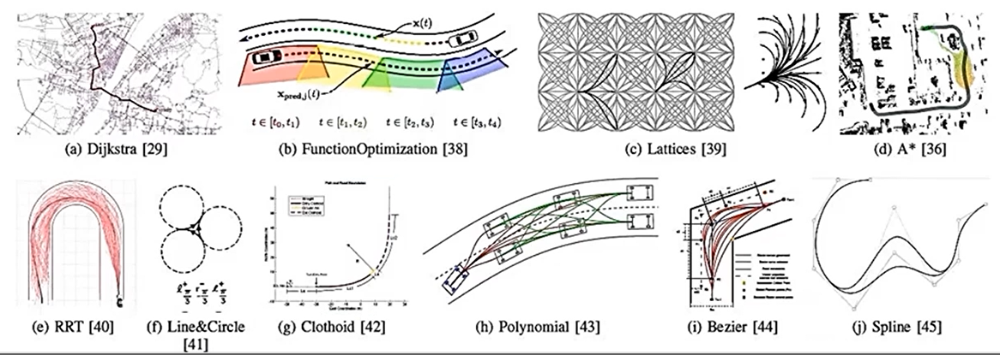
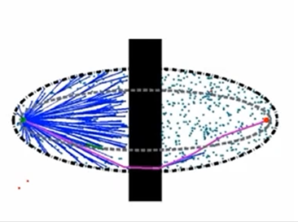
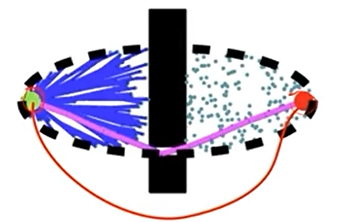
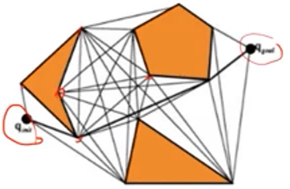

# 运动规划

## 总述

以最优性为核心，仔环境中给定起点和终点的条件下，规划机器人无碰的状态序列

## 规划器概念

### 完备性

指是否一定可以寻找到路径，如果是则说明具有完备性（例如：A*），如果完备性的规划器无解，那么这个问题无最优路径。

- **概率完备性**：只要时间足够长，就一定可以搜索成功（RRT）

  

- **决策完备性**：如果存在最优路径，通过足够长的时间，也一定可以搜索到路径，基于确定采样

### 效率（有效性）

- 时间复杂度，通常用 $O(n)$​​ 来表示

  

### 最优性

- 规划的路径在某个指标上最优
- 渐进最优：在不断搜索的情况下，都比原来的最优路径更优，即无法找到最优的情况下可以找到次优

例如，以路径长度为评价指标的话，粉色曲线明显优于红色曲线

### 约束性

- 局部约束：避免与障碍物碰撞
- 微分约束：转交曲线
- 全局约束

- 完整/非完整性约束

  - 完整性约束：可控的变量数量**等于**系统总体自由度
  - 非完整性约束： 可控的变量数量**小于**系统总体自由度

  例如，车辆转角有限制，即为非完整性约束；如果车辆可以朝着任意方向移动，则为完整性约束

## 规划方法

- 组合方法：可见图连接（通常是贴着障碍物边缘走）

  

- 采样方法：一种为确定采样（可以复现，通常用决策完备性去衡量），另一种为随机采样（通常要考虑概率完备性）