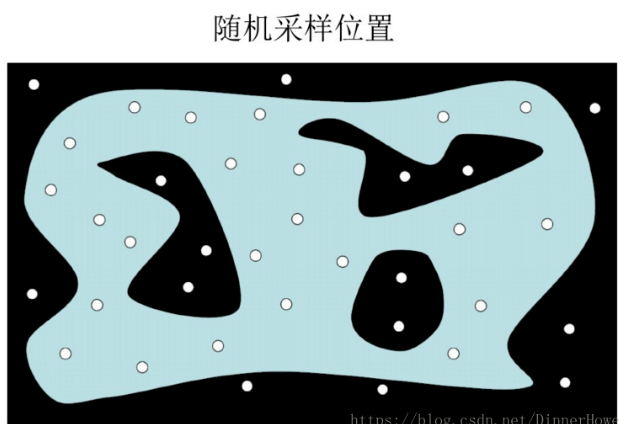
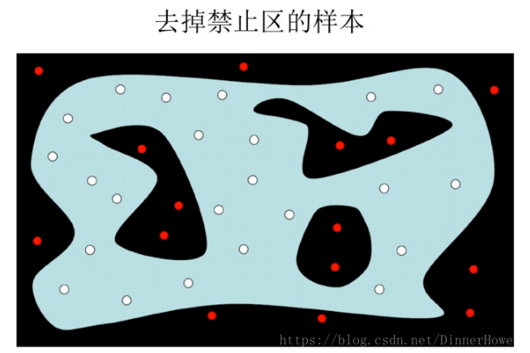
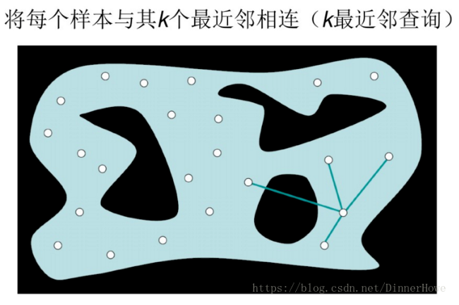
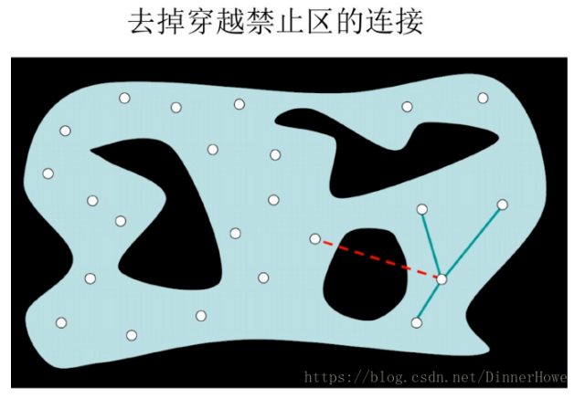
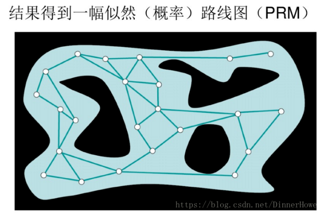
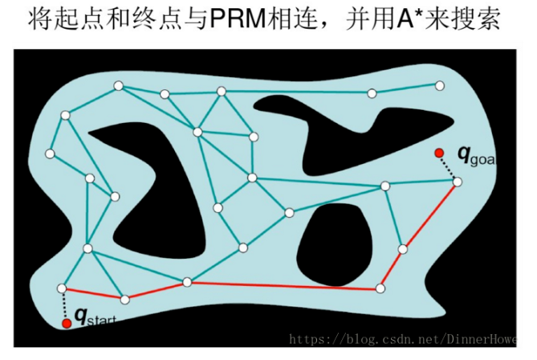

# 概率路线图算法(PRM)

## 算法原理

- 任务描述：从开始位置到目标位置的运动，通常涉及**两个基本问题**
  1.  **如何躲避障碍物**
  2. 如何满足机械、传感方面、加速度等约束 

- 基于采样的规划算法：**通常用于解决第1个问题**
  - 核心思想： 先对机器人的单个构型进行碰撞检测，建立无碰撞构型的数据库，再对不同的构型进行采样以生成无碰撞路径
  - 优点：具有通用性，只需要针对不同的机器人运动规划问题进行合理的参数调整
  - 缺点：完备性较弱，即当参数设置不合理时，即使存在可行的路径，也不一定能够找到
  -  分为两类：**综合查询法**和**单一查询法**
    - 综合查询法：首先构建路线图，先通过采样和碰撞检测建立完整的**无向图**，以得到构型空间的完整连接属性，再通过**图搜索**即可得到可行的路径。**PRM属于该种方法**
    - 单一查询法：从特定的初始构型出发局部建立路线图，在构型空间中延伸树型数据结构，最终使它们相连

## 算法流程

### 预处理

1. 初始化：设G(V,E)为一个无向图，其中顶点集 V代表无碰撞的顶点集，连线集E代表无碰撞路径。初始状态为空

   

2. 构型采样：从构型空间中采样一个无碰撞的点a(i)并加入到顶点集 V 中

   

3. 领域计算：定义距离 ρ，对于已经存在于顶点集V 中的点，如果它与a(i)的距离小于 ρ，则将其称作点a(i)的邻域点

4. 边线连接：将点a(i)与其领域点相连，生成连线τ 

   

5. 碰撞检测：检测连线 τ 是否与障碍物发生碰撞，如果无碰撞，则将其加入到连线集 E 中

   

6. 结束条件：当所有采样点（满足采样数量要求）均已完成上述步骤后结束，否则重复2-5

   

### 搜索

采用**图搜索算法**对无向图G进行搜索，如果能找到起始点A到终点B的路线，说明存在可行的路径规划方案

## 参数讨论

- 采样数量的影响

  - 对同一地图，采样点的数量越多，找到合理路径以及更优路径的概率就越大

  - 但同时，采样点数量越多，计算与搜索时间也会更长

- 领域设置的影响
  - 当邻域设置过小，由于连线路径太少，可能找不到解
  - 领域设置太大，会检测太多较远的点之间的连线，而增加耗时

**注意：**

1. **抽样方法的完备性很弱，即使空间中存在合理的路径，由于抽样参数的设置问题，也可能无法找到路径**
2. **由于抽样过程的随机性，该方法的稳定性也不好，对于同样的问题，前后两次的解也不一样，因此在严格要求稳定性的场合并不适用**