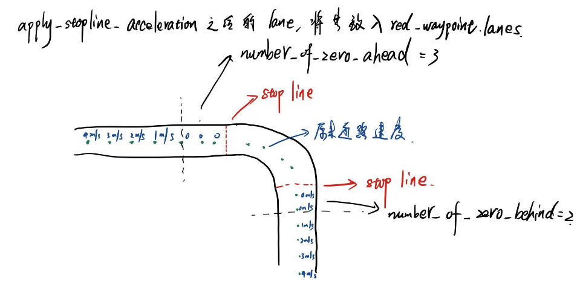

# 节点lane_rule源码分析

路径为`autoware\core_planning\lane_planner\nodes\lane_rule\lane_rule.cpp`


## 功能

- 对节点 `/waypoint_replanner` 和 `/lane_navi` 发布在话题 `/lane_waypoints_array` 中的路径点速度进行进一步修正，为红灯时在停车线内减速停车等场景提供支持。
- 所属功能包：lane_planner
- 订阅话题包括一众矢量图信息：`"/vector_map_info/point,lane,node,stop_line,dtlane" ` 和轨迹数组 `"/lane_waypoints_array"` 以及配置文件 `"/config/lane_rule"`。


## 分析

整个节点的主线逻辑：

对于传入到 `"/lane_waypoints_array"` 话题的多条全局路径加入道路规则的约束。首先是若矢量地图的信息接受不全，则原样将这些路径发布到 `"/traffic_waypoints_array"` 中去。若矢量地图信息完全，则依次处理其中每一条路径。按照路径找矢量地图中对于的 fine_vmap，找到之后先对这些 路径点先进行一个**速度衰减** `create_reduction()`，然后再进行一个**速度平滑操作**，主要是将临近三个点的速度平均值作为当前点的速度。然后按照交叉路口重新规划速度得到新的 路径，将这两条 路径 放入 `traffic_waypoint.lanes` 和 `green_waypoint.lanes` 待发布，然后再将同一条 路径 考虑进停车线并且为红灯时的情况，生成一条对应的 路径，然后放入 `red_waypoint.lanes`。最后将这三个路径数组发布出去。注意，这三个数组中的路径是一一对应的，到时候可以根据实时的道路交通情况及时根据索引进行车道选择。


### 1. 矢量图更新的回调函数 `cache_point()，cache_lane（）`等

与 lane_navi中的三个分别订阅点云、车道和节点的程序更新函数相同，主要用于接收矢量图信息，并在程序内部创建 `all_vmap` 矢量地图

1.1 `void update_values()` 需要等 `all_vmap` 所有信息完备后才可更新，首先根据 `all_vmap` 创建 `lane_vmap`，然后搜索矢量图中的所有 `dtlane` ，根据是否为弯道、十字路口和回旋道路，找到其中最小的 `curve_radius_min, crossroad_radius_min` 和 `clothoid_radius_min` ，然后根据之前接收到的 `"/lane_waypoints_array"` 创建的 `cached_waypoint` 去 `create_waypoint`。


### 2. `void config_parameter(const autoware_config_msgs::ConfigLaneRule& msg)`

去接收道路规则的配置信息，信息 `autoware_config_msgs::ConfigLaneRule` 为

```
Header header
float32 acceleration
float32 stopline_search_radius
int32 number_of_zeros_ahead
int32 number_of_zeros_behind
int32 number_of_smoothing_count
```


### 3. `void create_waypoint(const autoware_msgs::LaneArray& msg)`

在矢量地图信息未接收完全时，直接根据传入的 `LaneArray` 将其修改 header 后发布出去，发布的话题是 `"/traffic_waypoints_array"` ，当地图信息完备后便不进行此项操作。也就是保证有无完整地图两种情况下，都能有消息发布到对应话题中

### 3.1

`lane = apply_stopline_acceleration(lane, config_acceleration, config_stopline_search_radius,config_number_of_zeros_ahead, config_number_of_zeros_behind)`函数

这个函数是关键函数之一，就是重新按照加速度计算在遇到停车线时的加速减速问题。这里的逻辑是从某一个点开始就要按照固定加速度减速，然后减到停车线前 `config_number_of_zeros_ahead` 个点时速度就要为0，即安全距离。这里很有意思的是这个加减速方法，它先是按照加速的方法去规划速度，即停车线开始 `config_number_of_zeros_behind` 个点内的速度都设置为0，然后开始加速，直到加到原来的车道速度为止。然后它将道路排序反过来又进行了一次加速设置，那在原来的道路上呢就相当于减速了，即在停车点的 `config_number_of_zeros_ahead` 个点前开始速度就为0，再之前的部分就是通过恒定加速度减速到0的，非常的妙！



### 3.2

`lane.waypoints[j].twist.twist.linear.x *= create_reduction(fine_vmap, j)` 是对消息中每条道路的每一个点的速度做一个衰减，因为 `create_reduction()` 返回的值在 0和1之间，然后衰减程度主要是根据道路情况，也就是每一个点的 DTLane 来看。**总的来说是如果路点的曲率半径越小，则路弯道越大，速度衰减也就越大。**具体衰减程度与这三个参数相关，参数越大，对速度衰减影响越大。

```
pnh.param<double>("curve_weight", curve_weight, 0.6);
pnh.param<double>("crossroad_weight", crossroad_weight, 0.9);
pnh.param<double>("clothoid_weight", clothoid_weight, 0.215);
```


